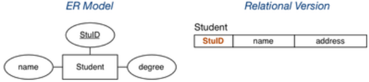
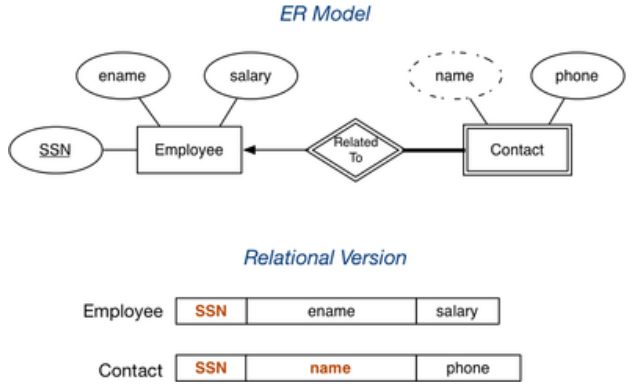
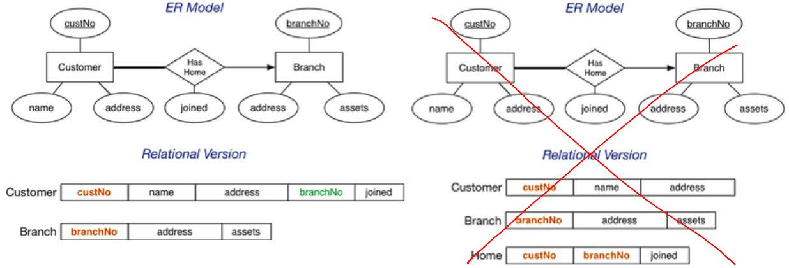
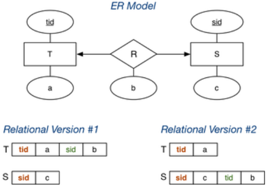
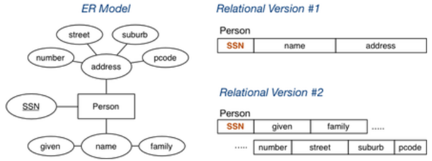
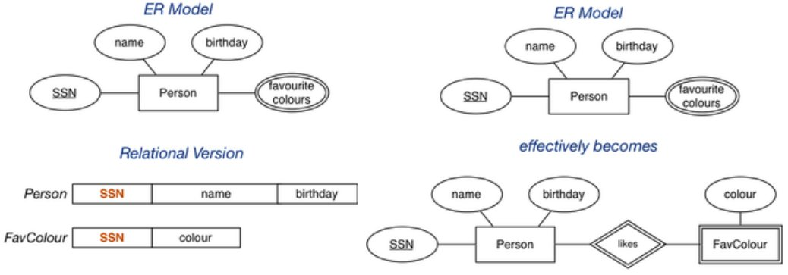
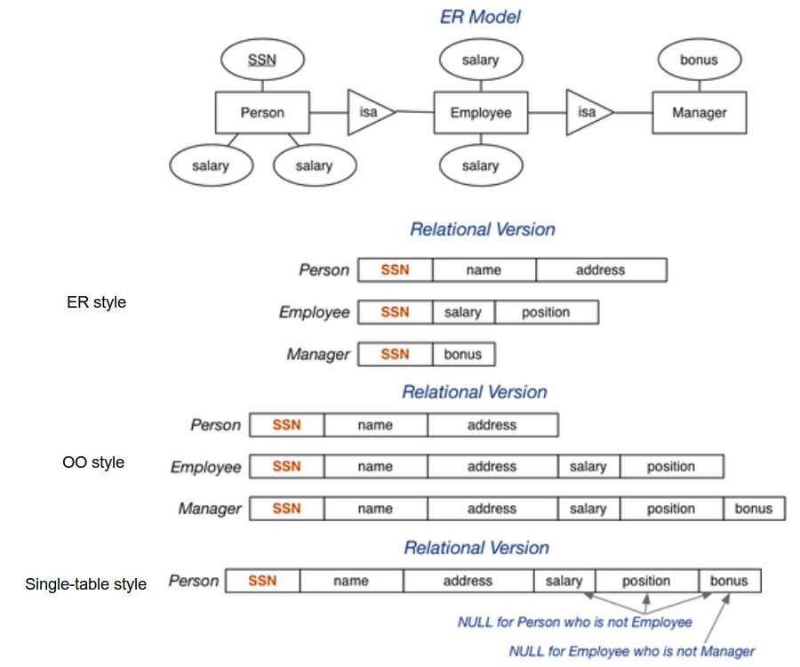

# Data Modelling and Database Design

## Data Modelling

The aim of data modelling is to

- describe what **information** is contained in the database; e.g. entities, students, courses, accounts etc.
- describe **relationships** between data
## Mapping ER Designs to Relational Schemas

One useful strategy for database design is to:

1. perform initial data modelling using ER (conceptual-level modelling)
2. transform conceptual design into relational model (implementation-level modelling)

A formal mapping exists for ER models to relational models. This maps "strucutres" but additional information is needed such as constraints domain for attributes and other constraints.

A general correspondence between relational and ER data models is:

- ER: attribute becomes Relational: attribute
- ER: entity becomes Relational: tuple
- ER: entity set becomes Relational: relation
- ER: relationship becomes Relational: relation

The differences between relational and ER models is:

- Relational models use relations to model entities **and** relationships
- Relational models have **no composite or multi-valued attributes** only atomic attributes
- Relational models have **no object-oriented notions** such as subclasses or inheritance

### Mapping Strong Entities

An entity set E with atomic attributes a1, a2, ..., an maps to a relations R with attributes (columns) a1, a2, ..., an.



Note that the key is preserved in the mapping.

### Mapping Weak Entities



Note that the primary key of the strong entity and the descriminator in the weak entity combine to form the primary key of the weak entity.

### Mapping N:M Relationships

Many-to-many relationships can be mapped to a new relation, where the primary keys of entities involved in the relationship are foreign keys in this relations. 


### Mapping 1:N Relationships

A one-to-many relationship can be mapped by having more values in one entity or by mapping to a new relation.



**Be wary about the correctness of your mappings.**

For the first method, if we made branch store `customerNo` and `joined`, since each customer has one branch, the same branch will appear multiple times, violating the primary key.we cannot guarantee that we represented total participation on the customer entity.

For the second method, when using a new relation to represent the relationship, we a are no longer able represent the cardinality of the relationship properly; the customer can have more than one branch (by appearing in multiple tuples) when it is only meant to have **one**

### Mapping 1:1 Relationships

When mapping one-to-one relationships, you will add relationship data to one entity/relation. Which relation you add it to depends on the participation of the relationship. 

If one entity is totally participant in the relationship, the relationship data should be added to that entity. Otherwise we won't be able to _enforce_ the concept of total participation as we won't know whether all tuples have been used.


If we stored `empNo` in Branch, some branches will have `NULL` values in `empNo` since it is not compulsory for the branch to have a manager. On the other hand, the manager relation will always have a value for its `branchNo`

If there is no reason to favour one side of the relationship, it does not matter where the relationship data is placed.



### Mapping n-way Relationships

Our previous relationship mappings assume the relationships are binary.  
If multiple entities are involves:

- `n:m` generalises naturally to `n:m:p:q`
  - includes a foreign key for each participating entity
  - include any other attributes of the relationship
- other multiplicities (e.g. `1:n:m`) need to be mapped the same as `n:m:p:q` so they do not quite accurately reflect the mapping of the ER diagram

Some people advocate converting n-way relationships into a new entity and a set of _n_ binary relationships.

### Mapping Composite Values

Composite values can be stored as a single concatenated attribute or separate values.



The first version has the advantage of being simpler and is useful if you don't intend to query or search the value.  
The second version has the advantage of being able to searched easily and precisely.

### Mapping Multi-valued Attributes

Multi-valued attributes are mapped by a new table linking values to their entity.



``` sql
-- the two entities
Person(12345, John, 12-feb-1990, [red,green,blue])
Person(54321, Jane, 25-dec-1990, [green,purple])
-- would be represented as
Person(12345, John, 12-feb-1990)
Person(54321, Jane, 25-dec-1990)
FavColour(12345, red)
FavColour(12345, green)
FavColour(12345, blue)
FavColour(54321, green)
FavColour(54321, purple)
```

### Mapping Subclasses

There are three different approaches to mapping subclasses to tables

- ER style - each entity becomes a separate table containing attributes of subclass and the foreign key of the super class
- object-oriented - each entity becomes a separate tables inheriting attributes from all superclasses
- single table with nulls - the whole class hierarchy becomes one tables containing all attributes of all subclasses, where unused values are set to `NULL`

Which mapping is best depends on how the data is used


