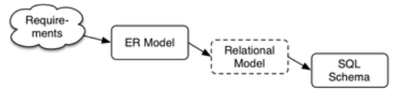
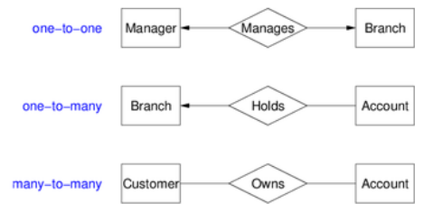
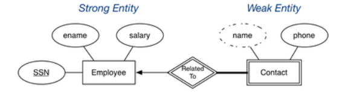
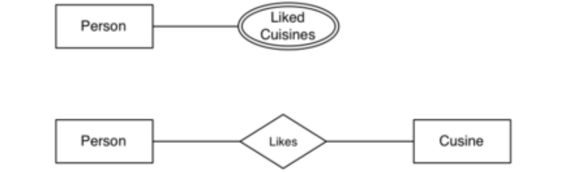
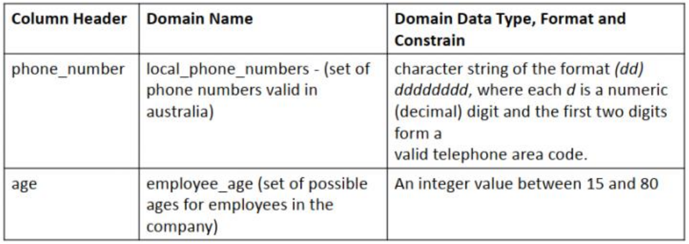

# Data Modelling and Database Design

## Data Modelling

The aim of data modelling is to

- describe what **information** is contained in the database; e.g. entities, students, courses, accounts etc.
- describe **relationships** between data items; e.g. John is enrolled in COMP3311, Tom's account is held at Coogee
- describe **constraints** on data; e.g. 7 digit IDs, students can enrol in no more than 3 courses per term

Data modelling is a design process that converts requirements into a data model. Data models can be _logical_ (i.e abstract, for conceptual design; e.g. ER models, ODL) or _physical_ (i.e record based, for implementation; e.g. relational models)

The strategy is to design using an abstract/logical model and then map to a physical model

We can to consider the following when we design models:

- start simple - we'll evolve the design as the problem is better understood
- identify objects (and their properties), then relationships
- most designs involve kinds (classes) of people
- keywords in requirements suggest data or relationships (a rule of thumb is: nouns -> data, verbs -> relationships)
- don't confuse operations with relationships; he _buys_ a book is an **operation**, the book _is owned_ by him is a **relationship**
- consider all possible data, not just what is available

### Design Quality

There is no single "best" design for a given application.  
Most import aspects of a design (data model) are

- **correctness** - satisfies requirements accurately
- **completeness** - all requirements are covered, all assumptions are explicit
- **consistency** - having no contradictory statements

Potential **inadequacies** in a design are those that:

- omit information that needs to be included
- contain redundant information, which leads to inconsistency
- lead to inefficient implementation
- violates syntactic or semantic rules of data models

## ER Modelling

In Entity-Relationship modelling, the world is viewed as a collection of **inter-related** entities. ER had three major modelling constructs:

- an **attribute**: a data item describing a property of interest
- an **entity**: a collection of attributes describing an object of interest
- a **relationship**: an association between entities (objects)

The ER model is not standard so many variations of it exist.

### ER Diagrams

ER diagrams are a graphical tool for data modelling. An ER diagram consists of:

- a collection of entity set definitions
- a collection of relationship set definitions
- attributes associated with entity and relationship sets
- connections between entity and relationship sets

Note that when discussing 'entity sets', we often just call them 'entities'

Here are specific visual symbols used to indicate different ER design elements:

Examples of ER diagrams:

#### Entity Sets

An **entity set** can be viewed as either a set of entities with the same set of attributes (extensional) or an abstract description of a class of attributes (intensional).

A **key** or **superkey** is any set of attributes whose set of values are distinct over an entity set. The set of attributes can be natural (i.e a combination of attributes) or artificial (i.e auto-generated like a student id). You can usually determine if a attribute is a key by determining whether it's value will be shared with other entities.  
A **candidate key** is a minimal superkey; i.e no subset of the superkey is a key.  
A **primary key** is a candidate key chosen by the database designer. For each entity there is **one** primary key.  

Keys are indicated in ER diagrams using **underlines**. If multiple attributes are underlines, then the set of attributes make the key.

#### Relationship Sets

A **relationship** is an association among several entities. e.g. a Customer _is the owner of_ Account  
A **relationship set** is a collection of relationships of the same type

The **degree** of a relationship is the  of entities involved in the relationship

The **cardinality** of a relationship is the  of associated entities on each side of the relationship

The **level of participation constraint** in a relation constrain can be defined as:  
The participation in a relationship set **R** by and entity set **A** may be

- **total** - every _a_∈_A_ participates in more than one relationship in **R**
- **partial** - only some _a_∈_A_ participates in relationships in **R**

E.g every bank loan is taken out by at least one customer, but not every customer has a bank loan

In some cases, a relationship needs associated attributes

#### Weak Entity Sets

A **weak entity exists** only because of an association with strong entities; it cannot exist without the strong entities it is associated with. They do not have key of their own, but they do have a **descriminator** which is denoted using a dotted underline or the same symbol as a derived attributes

#### Subclasses and Inheritance

A **subclass** of an entity set A is a set of entities with

- all attributes of A, plus (usually) its own attributes
- all relationships A is involved in, plus its own

Subclasses can be:

- **overlapping** or **disjoint** (can an entity be in multiple subclasses?)  
Overlapping inheritance: the entity can be this or that or both
Disjoint inheritance: the entity is must be one or the other but not both
- **total** or **partial** (does every entity have to also be in a subclass?)  
Partial participation does not have to be who inherits it.
Total participation means you cannot be the parent

A special case of inheritance is when an entity has **one subclass**; i.e "B _is a_ A" specialisation"

#### Design Using the ER Model

ER models are a simple, powerful set of data modelling tools. Some considerations to take when designing ER models:

- should an "object" be represented by an attribute or entity?
- is a "concept" best represented as an entity or relationship?
- should we use n-way relationships or several 2-way relationships?
- is an "object" a strong or weak entity?
- are there subclasses/superclasses within the entities?

Answers to the above are worked out by _thinking_ about the application domain

For example: we have two ways to represent "a person has some types of foods that they like"

The option you choose depends on how you want to represent your food.  
Will it have attributes such as its ingredients and other operations done on the attributes? Then the second option is better. Do we only want to the food name and nothing else? Then the first option is better.  
Performance in this problem is not an issue as the operation in the end is _doable_ but perhaps not convenient, but this is not a design issue.

## Relational Data Modelling

The relational data model described the world as a collection of inter-connected _relations (or tables)_.  
The goal of a relational model is to have a simple, general data modelling _formalism_ which maps easily to file structures (i.e. implementable)

A relational model has two styles of terminology:

- mathematical: relation, tuple, attribute, etc.
- data-oriented: table, record, field/column, etc.

The relational model has one structuring mechanism:

- a _relation_ corresponds to a mathematical "relation" and can also be viewed as a "table"

Each relation (denoted R,S,T,...) has a:

- a **name** unique within a given **database**
- a **set of attributes** which can be viewed as columns or headings

Each attribute (denoted A,B,... or a1,a2,...) has:

- a **name** unique within a given **relation**
- an associated domain, which is a set of allowed values (e.g. strings only, numbers, n-digits etc.)

The database definition also uses _constraints_ (logic expressions)

A tuple (row) is a set of values (attribute or column values). Attribute values:

- are **atomic** (there are no composite or multi-valued attributes). Derived attributes do not need to be modelled in a relational model but can be
- belong to a **domain**, which has a name, data type and format. A distinguished `NULL` value belongs to all domains. A `NULL` has several interpretations; none, don't know, irrelevant

A **relation (table)** is a set of tuples. Since a relation is a set, there is **no ordering** of rows. Normally we define a standard ordering on components of a tuple. The following are different representations of the same relation:

Each relation generally has a primary key (a subset of attributes, unique over the relation).

A database is a set of relations (tables)

### Expressing a Relational Data Model Mathematically

Note: tuples (2,3) ≠ (3,2) but relation: {(a,b), (c,d)} = {(c,d), (a,b)}

Examples of ER data models, a relation schema and relation instance

### Integrity Constraints

To represent real-world problems, we need to describe:

- what values are/aren't allowed
- what combinations of values are/aren't allowed

**Constraints** are logical statements that do this:

- **domain constraints** limit the set of values that attributes can take  
e.g. `Employee.age` attribute is typically defined as an `integer` often better modelled by having an extra constraint `15<age<66`
Note that `NULL` satisfies all domain constraints except `NOT NULL`
- **key constraints** identify attributes that uniquely identify tuples in a relation. A relation can have more than one key, so each key is a **candidate key**  
e.g. `Student(id,...)` is guaranteed to be unique, `Class(...,day,time,location,...)` is unique
- **entity integrity contraints** require keys to be fully-defined, that is no primary key value can be `NULL`  
e.g. `Class(...,Mon,2pm,Lyre)` is well-defined but `Class(...,NULL,2pm,Lyre,...)` is not well-defined
- **referential integrity constraints** require references to other tables to be valid. These references are known as **foreign keys**. A set of attributes F in R1 is a foreign key in R2 if:
    - the attributes in F correspond to the primary key of R2
    - the value of F in each tuple of R1 either occurs as a primary key in R2 or is entirely `NULL`
Foreign keys are critical in relational databases because they provide:
    - the _glue_ that links individual relations (tables)
    - the way to assemble query answers from multiple tables
    - the relational representation of ER relationships

