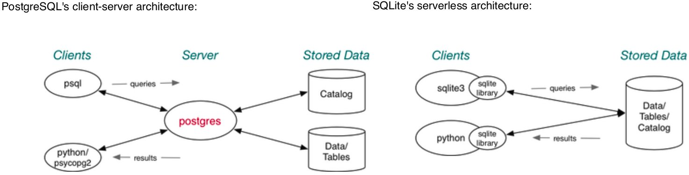

# RDBMS and SQL

## Relational DBMS

A **relational database management system (RDBMS)** is software:

 * designed to support large-scale data-intensive applications
 * allowing high-level description of data (tables, constraints)
 * with high-level access to the data (relational model, SQL)
 * providing efficient storage and retrieval (disk/memory management)
 * supporting multiple simultaneous users (privilege, protection)
 * doing multiple simultaneous operations (transactions, concurrency)
 * maintaining reliable access to the stored data (backup, recovery)

Note: databases provide **persistent** storage of information

In COMP3311 we use:

* PostgreSQL - a full-featured, **client-server** DBMS, which is resource intensive
  * applications communicate via a server to the database
  * can run distributed and replicated
  * follows SQL standard closely, but not totally
  * has extra data types (e.g. JSON), multiple procedural languages
* SQLite - a full-featured, **serverless** DBMS, which is a light user of resources
  * is intended to be embedded in applications
  * follows SQL standard closely, but not totally
  * has no stored procedures, JSON, adds functions via programming languages



### Using PostgreSQL on CSE

Using your PostgreSQL server on CSE:

1. login to `grieg`  
`ssh grieg`
2. set up environment: see [lab02](https://cgi.cse.unsw.edu.au/~cs3311/20T1/pracs/02/index.php)
3. start server  
`pgs start`
4. use `psql` etc. to manipulate databases: see [lab02](https://cgi.cse.unsw.edu.au/~cs3311/20T1/pracs/02/index.php)
5. stop server  
`pgs stop`
6. log off `grieg`  
`logout` or `exit` or `ctrl-d`

Your PostgreSQL's home directory is located in `srvr/$USER/psql/data`.  
`/srvr/$USER/env` is where PostgreSQL's environment settings are stored
Under the home directory;

* `postgresql.conf` is the main configuration file
* `base/` is the subdirectory containing database files
* `postmaster.pid` is the process ID of the server process
* `.s.PGSQL.5432` is socket for clients to connect to the server
* `.s.PGSQL.5432.lock` is the lock file for the socket

## Building and Maintaining Databases

Shell commands to **create** and **remove** databases:

* `creatdb <dbname>` creates a new empty database
* `dropdb <dbname>` removes **all** data associated with a database

If no `dbname` is supplied, it assumes the database is called `$USER`

Shell commands to **dump** and **restore** database contents:

* `pg_dump <dbname> > <dumpfile>` to dump the database in `dumpfile`
* `psql <dbname> -f <dumpfile>` to restore the database from `dumpfile`

SQL statements used in `dumpfile`: `CREATE TABLE`, `ALTER TABLE`, `COPY`

SQL statements for **managing tables**:

* `CREATE TABLE table(attributes + constraints)`
* `ALTER TABLE table tableSchemaChanges`
* `DROP TABLE table(s) [CASCADE]`
* `TRUNCATE TABLE table(s) [CASCADE]`

`DROP ... CASCADE` also drops objects which depend on the table. Objects could be tuples, view but not whole table.  
`TRUCATE ... CASCADE` truncates tables which refer to the table

SQL statements for **managing tuples**:

* `INSERT INTO table (attrs) VALUES (tuple(s))` where `attrs=(attr1, attr2, ..., attrn)` and `tuple=(val1, val2, ..., valn)`
* `DELETE FROM table WHERE conditions`
* `UPDATE table SET attrValueChanges WHERE conditions` where `attrValueChanges` is a comma-separated list of `attrName=expression`

Databases contain objects other than tables and tuples; views, functions, sequences, types. indexes, roles etc.  
Most have SQL statements for:

* `CREATE ObjectType name ...`
* `DROP ObjectType name ...`

Views and functions also have available:  
`CREATE OR REPLACE ObjectType name ...`

## SQL

**SQL** or **Structured Query Language** has several sub-languages:

* meta-data definition language (e.g. `CREATE TABLE`)
* meta-data update language (e.g. `ALTER TABLE`)
* data update language (e.g. `INSERT`,`UPDATE`,`DELETE`)
* query language (SQL) (e.g. (`SELECT`)

Meta-data languages manages the _schema_  
Data languages manipulate (sets of) _tuples_  
Query languages are based on _relational algebra_

### Types/Constants in SQL

Numeric types:

* `INTEGER`
* `REAL`
* `NUMERIC(w, d)`

String types:

* `CHAR(n)`
* `VARCHAR(n)`
* `TEXT`

PostgreSQL provides extended strings containing `\` escapes  
e.g. `E'\n'`, `E'O\'Brien'`, `E'[A-Z]{4}\\d{4}'`, `E'John'`

Typecasting is also allowed via; `expr::type` e.g. `'10'::integer`

Logical types: `BOOLEAN`, `TRUE` and `FALSE` (or `true` and `false`)  
PostgreSQL also allows `t ``true`, `yes`, `f`, `false`, `no`

Time related types:

* `DATE`
* `TIME`
* `TIMESTAMP`
* `INTERVAL`  
Subtraction of timestamps results in an interval. e.g. `now()::TIMESTAMP - birthdate::TIMESTAMP`

PostgreSQL also has a range of non-standard types such as  geometric (point/line/...), currency, IP addresses, JSON, XML, objectIDs, etc. Non-standard types typically use string literals (`'...'`) which need to be interpreted

Users can also define their own types in several ways:

``` sql
-- domains: constrained version of existing types
CREATE DOMAIN Name AS Type CHECK (Constraint);

-- tuple types: defined for each type
CREATE TYPE Name as (AttrName AttrType, ...);

-- enumerated types: specify elements and ordering
CREATE TYPE Name as ENUM ('Label', ...);
```

### Tuple and Set Literals

Tuples and set constants are both written as `(val1, val2, val3, ...)`  
The correct interpretation is worked out from the context.

Examples:
``` sql
-- tuple literal
INSERT INTO Student(studentID, name, degree) VALUES (2177364, 'Jack Smith', 'BSc');

-- set literal
CONSTRAINT CHECK gender in ('male', 'female');
```

### SQL Operators

**Comparison operators** are defined on all types: `<`, `>`, `<=`, `>=`, `=`, `<>`  
In PostgreSQL, `!=` is a synonym for `<>` but there is no `==`

**Boolean operators** `AND`, `OR` and `NOT` are also available, but note that `AND` and `OR` are not _short-circuit_ in the same way as C's `&&` and `||`

Most data types also have type-specific operations available

**String comparison**:  
`str1 < str2` compares using dictionary order  
`str LIKE pattern` matches string to pattern. Pattern matching uses SQL specific expressions:

* `%` matches anything (like `.*` in regex)
* `_` matches any single char (like `.` in regex)

Examples:
``` sql
name LIKE 'Ja%'     name beginning with 'Ja'
name LIKE '_i%'     name has 'i' as the second letter
name LIKE '%o%o%'   name contains two 'o's
name LIKE '%ith'    name ends with 'ith'
name LIKE 'John'    name equals 'John'
```

Many DBMSs also provide regexp-based pattern matching.  
PostgreSQL uses `~` and `!~` operators for this:  
`Attr ~ 'regexp'` or `Attr !~ 'regexp'`  
PostgreSQL also provides case-insensitive matching:  
`Attr ~* 'regexp'` or `Attr !~* 'regexp'`  
It also provide full-text searching

Examples of regex pattern matching:
``` sql
name ~ '^Ja'        name beginning with 'Ja'
name ~ '^.i'        name has 'i' as the second letter
name ~ '.*o.*o.*'   name contains two 'o's
name ~ 'ith$'       name ends with 'ith'
name ~ 'John'       name equals 'John'
```

**String manipulation**:

* `str1||str2` returns the concatenation of `str1` and `str2`
* `lower(str)` returns the lowercase version of `str`
* `substring(str, start, count)` extracts a substring from `str`

Note that the above operations are null-preserving (strict). If any operand is `NULL` the result is `NULL`.  
Beware of `<a>||' '||<b>`. It is null if either `a` or `b` is `NULL`

**Arithmetic operators**:
`+`, `-`, `*`, `/`, `abs`, `ceil`, `floor`, `power`, `sqrt`, `sin`, etc  
_Aggregations_ "summarise" a column of numbers in a relations:

* `COUNT(attr)` gets the # of rows in `attr` column
* `SUM(attr)` sums the values of `attr`
* `AVG(attr)` gets the mean of values in `attr`
* `MIN()/MAX(attr)` gets the min/max value in `attr`

### The `NULL` Value

### Conditional Expressions

### SQL Queries

### Views
