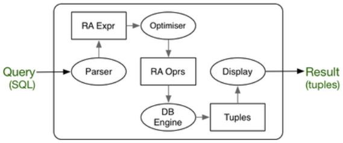

# DBMS Architecture

Knowing about DBMS architecture can help avoid/fix inefficiencies in database applications and ensure there are no concurrency issues.

DBMSs attempt to handle these issues in:

* **query processing (QP)** - methods for evaluating queries
* **transaction processing (TxP)** - controlling concurrency

As a programmer you give up a lot of control to the DBMS, but you can use

* QP knowledge to make DB applications **_efficient_**
* TxP knowledge to make DB applications **_safe_**

So far we have viewed a DBMS as a machine that processes SQL queries


One view of a database engine is a **_relational algebra virtual machine_** for operation; selection, projection, join, union, intersection, difference, sort, insert, delete.  
For each of these operations various data structures and algorithms are available. The DBMS may provide only one, or provide a choice.

Layers in a database engine (Ramakrishnan's View)


## Query Evaluation

The path of a query through its evaluation:



1. SQL is mapped to relational algebra
2. relational algebra expressions are optimised
3. database engine executes expressions to produce result

### Mapping SQL to relational algebra

``` sql
-- schema: R(a,b) S(c,d)
select a as x
from R join S on (b=c)
where d = 100;
-- could be mapped to
Tmp1(a,b,c,d) = R Join[b=c] S
Tmp2(a,b,c,d) = Sel[d=100](Tmp1)
Tmp3(a,b,c,d) = Proj[a](Tmp2)
Res(x) = Rename[Res(x)](Tmp3)
```

In general:

* `SELECT` clause becomes _projection_
* `WHERE` condition becomes _select_ or _join_
* `FROM` clause becomes _join_

A better approach of the translate query above would be

``` sql
Tmp1(a,b,c,d) = Sel[d=100](S)
Tmp2(a,b,c,d) = R Join[b=c] Tmp2
Tmp3(a,b,c,d) = Proj[a](Tmp2)
Res(x) = Rename[Res(x)](Tmp3)
```

Re-ordering the first two expressions helps filter out the amount of tuples processed; hence decreasing processing time.

The query: "Courses with more than 100 students in them?"

``` sql
-- Can be expressed in SQL as
select s.id, s.code
from Course c, Subject s, Enrolment e
where c.id = e.course and c.subject = s.id
group by s.id, s.code
having count(*) > 100;
-- and might be compiled to
Result = Project [id,code] (
    GroupSelect [size>100] (
        GroupBy [id,code] (
            Subject Join [s.id=c.subject] (Course Join[c.id=e.course] Enrolment)
        )
    )
)
-- this can be broken down into individual RA statements
Tmp1(sid,stu)= Course Join[c.id=e.course] Enrolment
Tmp2(sid,code,stu) = Subject Join[s.id=c.subject] Tmp1
Tmp3(sid,code,nstu) = GroupBy[id,code](Tmp2)
Result(sid,code) = Sel[nstu>100](Tmp3)
```

### Query Cost Estimation

The cost of evaluating a query is determined by

* the operations specified in the query execution plan
* size of relations (database relations and temporary relations)
* access mechanisms (indexing, hashing, sorting, join algorithms)
* size/number of main memory buffers (and replacement strategy)

Analysis of costs involves **estimating** the size of intermediate results and then, based on this, the cost of secondary storage accesses

Accessing data from the disk (I/O) the dominant cost in query evaluations

An **execution plan** is a sequence of relational operations.  
Consider the execution plan for σc (R ⋈ d S ⋈ e T)

``` sql
tmp1   := hash_join[d](R,S)
tmp2   := sort_merge_join[e](tmp1,T)
result := binary_search[c](tmp2)
-- or
tmp1   := sort_merge_join[e](S,T)
tmp2   := hash_join[d](R,tmp1)
result := linear_search[c](tmp2)
-- or
tmp1   := btree_search[c](R)
tmp2   := hash_join[d](tmp1,S)
result := sort_merge_join[e](tmp2)
```

All produce the same result, but have different costs

### Implementation of RA Operations

**Sorting** (quicksort, etc. are not applicable)

* external merge sort (cost O(Nlog B N) with B memory buffers)

**Selection** (different techniques developed for different query types)

* sequential scan (worst case, cost O(N))
* index-based (e.g. B-trees, cost O(logN), tree nodes are pages)
* hash-based (O(1) best case, only works for equality tests)

**Join** (fast joins are critical to success of relational DBMSs)

* nested-loop join (cost O(N.M), buffering can reduce to O(N+M))
* sort-merge join (cost O(NlogN+MlogM))
* hash-join (best case cost O(N+M.N/B), with B memory buffers)

### Query Optimisation

The "best" method for evaluating a query is making it have the **lowest cost** (i.e fast evaluation time)

**Cost** is measured in terms of pages read/written

* data is stored in fixed-size blocks (e.g. 4KB)
* data is transferred between disk and memory in whole blocks
* the cost of disk-memory transfer is the highest cost in the system
* processing in memory is very fast compared to I/O

A DBMS **query optimiser** works as follows:

``` sql
Input: relational algebra expression
Output: execution plan (sequence of RA ops)

bestCost = INF; bestPlan = none;
while (more possible plans) {
    plan = produce a new evaluation plan
    cost = estimated_cost(plan)
    if (cost < bestCost) {
        bestCost = cost; bestPlan = plan;
    }
}
return bestPlan
```

Typically, there are **very** many possible plans. Smarter optimisers generate a likely subset of possible plans

## Database Application Performance

In order to make database applications efficient, it is useful to know:

* what operations on the data does the application requires (which queries, updates, inserts and how frequently is each one performed)
* how these operations might be implemented in the DBMS (data structures and algorithms for select, project, join, sort, etc.)
* how much each implementation will cost (in terms of the amount of data transferred between memory and disk)

and then, "encourage" DBMS to use the most efficient methods.

We can achieve this by using indexes and avoiding certain SQL query structures

Application programmer choices that affect query cost:

* how queries are expressed
    * generally `join` is faster than sub-query, especially if the sub-query is correlated
    * filter first, then `join` (avoid large intermediate tables)
    * avoid applying functions in `where`/`group by` clauses
* creating _indexes_ on tables
    * index will speed-up filtering based on indexed attribtues
    * indexes are generally only effective on `=`, `<`, `>`
    * mainly useful if filtering occurs  much more frequent than updates

Whatever you do as a database application programmer, the DBMS will transform your query and attempt to make it execute as efficiently as possible.  
The transformation is carried out by the **query optimiser**, which assesses possible query execution approaches and evaluates the likely cost of each approach. It chooses the approach with the cheapest cost.  
You have no control over the optimisation process, but the choices you make can block certain options limiting the query optimiser's chance to improve

Example: query to find sales people earning more than $50K
