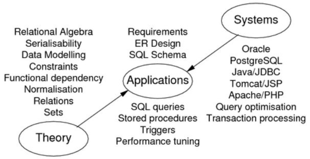
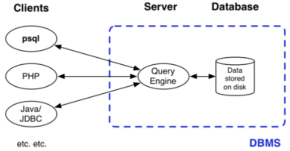

# Overview

## Why Databases?

Every significant modern computer application has **large data**

This needs to be:

- **stored** typically on a disk device
- **manipulated** efficiently and usefully
- **shared** by many users concurrently
- **transmitted** all around the Internet

The first three points are handled by databases while the last one is handled by networks.

The field of databases deals with:

- _data_ representing application scenarios
- _relationships_ amongst data
- _constraints_ on data and relationships
- _redundancy_ so that each data item has one source
- _data manipulation_ which is declarative or procedural
- _transactions_ covering multiple actions which are either completed or not
- _concurrency_ covering multiple users sharing data
- _scale_ for massive amounts of data

## What is Data? What is a Database?

According to the Elmasri/Navathe textbook,

- **data** is a known fact, with implicit meaning; e.g. a student's name, a product id
- a **database** is a collection of related data which satisfies constraints; e.g. a student is _enrolled_ in a course, a product _is sold_ at a store
- a **DBMS** is a database management system which is software to manage data, control access and enforce constraints; e.g. PostgreSQL, SQLite, Oracle, SQL Server, MySQL

## Overview of the Database Field

Database application development is variation on standard software engineering process:

1. analyse application requirements
2. develop a data model to meet these requirements
3. define operations (transactions) on this model
4. implement the data model as a relational schema
5. implement transactions via SQL and procedurals languages
6. construct an interface to these transactions

At some point, populate the database (maybe via the interface)

## Database System Architecture

The typical environment for a typical DBMS is:

SQL queries and results travel along the client-server links
