# Data Modelling and Database Design

## Data Modelling

The aim of data modelling is to

* describe what **information** is contained in the database; e.g. entities, students, courses, accounts etc.
* describe **relationships** between data items; e.g. John is enrolled in COMP3311, Tom's account is held at Coogee
* describe **constraints** on data; e.g. 7 digit IDs, students can enrol in no more than 3 courses per term

Data modelling is a design process that converts requirements into a data model. Data models can be _logical_ (i.e abstract, for conceptual design; e.g. ER models, ODL) or _physical_ (i.e record based, for implementation; e.g. relational models)

The strategy is to design using an abstract/logical model and then map to a physical model

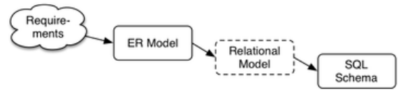

We can to consider the following when we design models:

* start simple - we'll evolve the design as the problem is better understood
* identify objects (and their properties), then relationships
* most designs involve kinds (classes) of people
* keywords in requirements suggest data or relationships (a rule of thumb is: nouns -> data, verbs -> relationships)
* don't confuse operations with relationships; he _buys_ a book is an **operation**, the book _is owned_ by him is a **relationship**
* consider all possible data, not just what is available

### Design Quality

There is no single "best" design for a given application.  
Most import aspects of a design (data model) are

* **correctness** - satisfies requirements accurately
* **completeness** - all requirements are covered, all assumptions are explicit
* **consistency** - having no contradictory statements

Potential **inadequacies** in a design are those that:

* omit information that needs to be included
* contain redundant information, which leads to inconsistency
* lead to inefficient implementation
* violates syntactic or semantic rules of data models

## ER Modelling

In Entity-Relationship modelling, the world is viewed as a collection of **inter-related** entities. ER had three major modelling constructs:

* an **attribute**: a data item describing a property of interest
* an **entity**: a collection of attributes describing an object of interest
* a **relationship**: an association between entities (objects)

The ER model is not standard so many variations of it exist.

### ER Diagrams

ER diagrams are a graphical tool for data modelling. An ER diagram consists of:

* a collection of entity set definitions
* a collection of relationship set definitions
* attributes associated with entity and relationship sets
* connections between entity and relationship sets

Note that when discussing 'entity sets', we often just call them 'entities'

Here are specific visual symbols used to indicate different ER design elements:

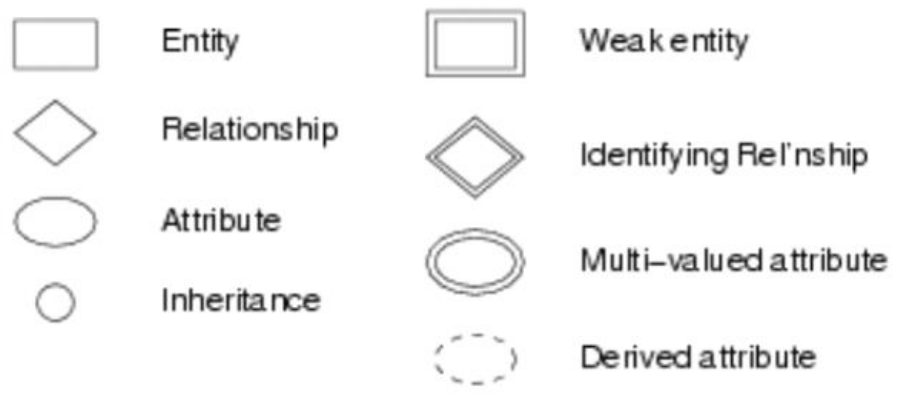

Examples of ER diagrams:

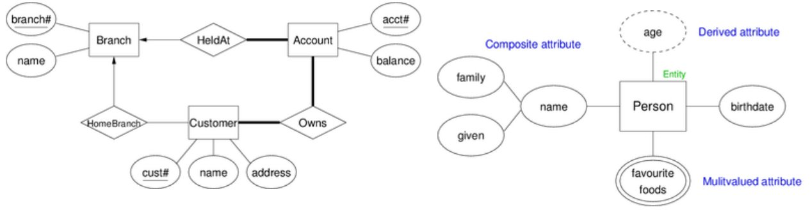

#### Entity Sets

An **entity set** can be viewed as either a set of entities with the same set of attributes (extensional) or an abstract description of a class of attributes (intensional).

A **key** or **superkey** is any set of attributes whose set of values are distinct over an entity set. The set of attributes can be natural (i.e a combination of attributes) or artificial (i.e auto-generated like a student id). You can usually determine if a attribute is a key by determining whether it's value will be shared with other entities.  
A **candidate key** is a minimal superkey; i.e no subset of the superkey is a key.  
A **primary key** is a candidate key chosen by the database designer. For each entity there is **one** primary key.  

Keys are indicated in ER diagrams using **underlines**. If multiple attributes are underlines, then the set of attributes make the key.

#### Relationship Sets

A **relationship** is an association among several entities. e.g. a Customer _is the owner of_ Account  
A **relationship set** is a collection of relationships of the same type

The **degree** of a relationship is the  of entities involved in the relationship

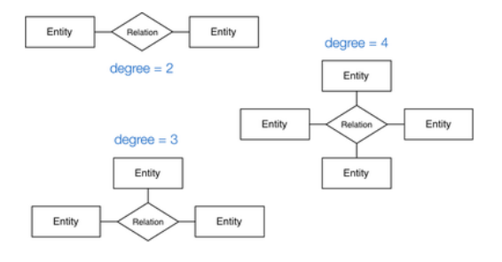

The **cardinality** of a relationship is the  of associated entities on each side of the relationship

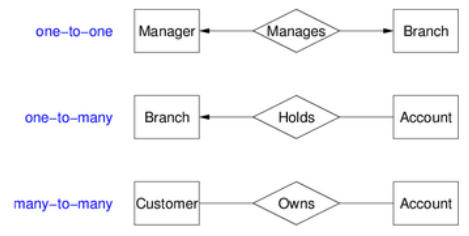

The **level of participation constraint** in a relation constrain can be defined as:  
The participation in a relationship set **R** by and entity set **A** may be

* **total** - every _a_ ∈ _A_ participates in more than one relationship in **R**
* **partial** - only some _a_ ∈ _A_ participates in relationships in **R**

E.g every bank loan is taken out by at least one customer, but not every customer has a bank loan


In some cases, a relationship needs associated attributes

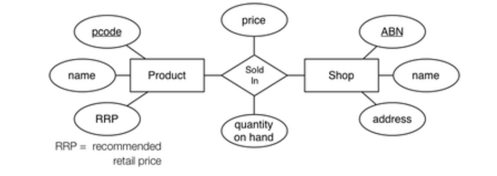

#### Weak Entity Sets

A **weak entity** exists only because of an association with strong entities; it cannot exist without the strong entities it is associated with.  
They do not have key of their own, but they do have a **descriminator** which is denoted using a dotted underline or the same symbol as a derived attributes. Weak entities are are always **totally participant** in a relationship.

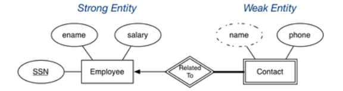

#### Subclasses and Inheritance

A **subclass** of an entity set A is a set of entities with

* all attributes of A, plus (usually) its own attributes
* all relationships A is involved in, plus its own

Subclasses can be:

* **overlapping** or **disjoint** (can an entity be in multiple subclasses?)  
Overlapping inheritance: the entity can be this or that or both  
Disjoint inheritance: the entity is must be one or the other but not both
* **total** or **partial** (does every entity have to also be in a subclass?)  
Partial participation does not have to be who inherits it.  
Total participation means you cannot be the parent

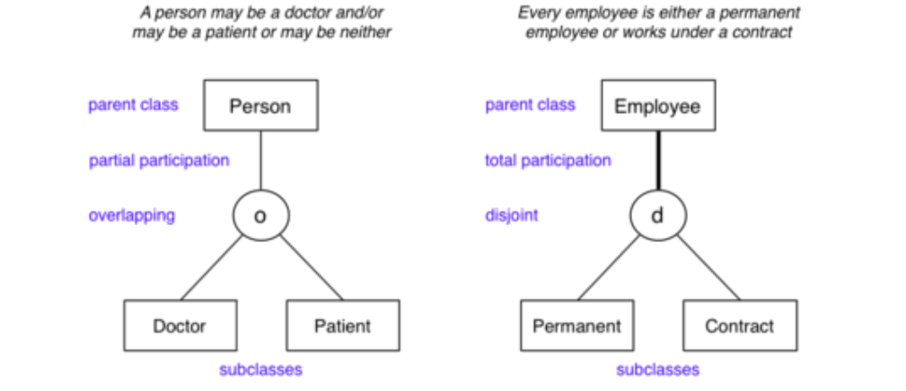

A special case of inheritance is when an entity has **one subclass**; i.e "B _is a_ A" specialisation"


### Design Using the ER Model

ER models are a simple, powerful set of data modelling tools. Some considerations to take when designing ER models:

* should an "object" be represented by an attribute or entity?
* is a "concept" best represented as an entity or relationship?
* should we use n-way relationships or several 2-way relationships?
* is an "object" a strong or weak entity?
* are there subclasses/superclasses within the entities?

Answers to the above are worked out by _thinking_ about the application domain

For example: we have two ways to represent "a person has some types of foods that they like"

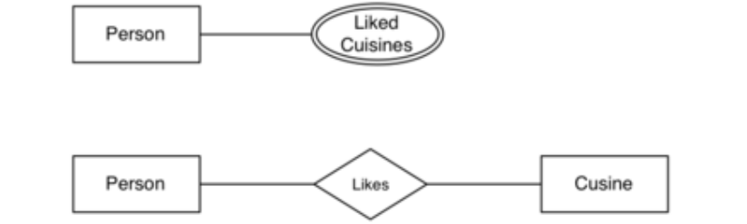

The option you choose depends on how you want to represent your food.  
Will it have attributes such as its ingredients and other operations done on the attributes? Then the second option is better. Do we only want to the food name and nothing else? Then the first option is better.  
Performance in this problem is not an issue as the operation in the end is _doable_ but perhaps not convenient, but this is not a design issue.

## Relational Modelling

The relational data model described the world as a collection of inter-connected _relations (or tables)_.  
The goal of a relational model is to have a simple, general data modelling _formalism_ which maps easily to file structures (i.e. implementable)

A relational model has two styles of terminology:

* mathematical: relation, tuple, attribute, etc.
* data-oriented: table, record, field/column, etc.

The relational model has one structuring mechanism:

* a _relation_ corresponds to a mathematical "relation" and can also be viewed as a "table"

Each relation (denoted R,S,T,...) has a:

* a **name** unique within a given **database**
* a **set of attributes** which can be viewed as columns or headings

Each attribute (denoted A,B,... or a1,a2,...) has:

* a **name** unique within a given **relation**
* an associated domain, which is a set of allowed values (e.g. strings only, numbers, n-digits etc.)

The database definition also uses _constraints_ (logic expressions)

A tuple (row) is a set of values (attribute or column values). Attribute values:

* are **atomic** (there are no composite or multi-valued attributes). Derived attributes do not need to be modelled in a relational model
* belong to a **domain**, which has a name, data type and format. A distinguished `NULL` value belongs to all domains. A `NULL` has several interpretations; none, don't know, irrelevant

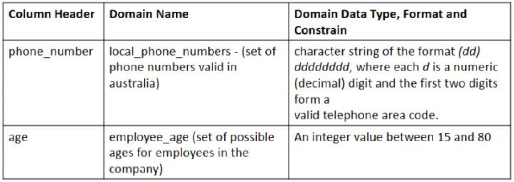

A **relation (table)** is a set of tuples. Since a relation is a set, there is **no ordering** of rows. Normally we define a standard ordering on components of a tuple. The following are different representations of the same relation:

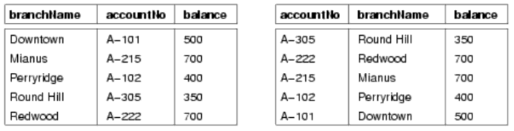

Each relation generally has a primary key (a subset of attributes, unique over the relation).

A database is a set of relations (tables)

### Expressing a Relational Data Model Mathematically

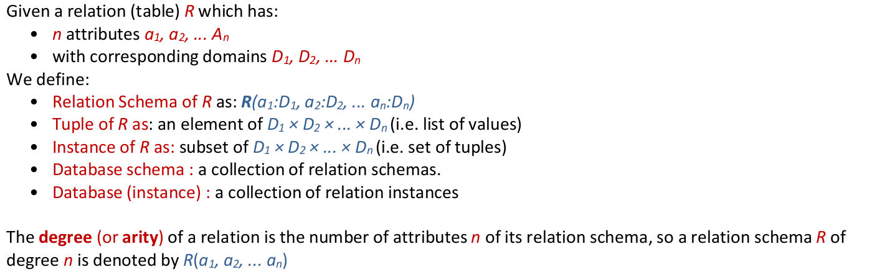

Note: tuples (2,3) ≠ (3,2) but relation: {(a,b), (c,d)} = {(c,d), (a,b)}

Examples of ER data models, a relation schema and relation instance

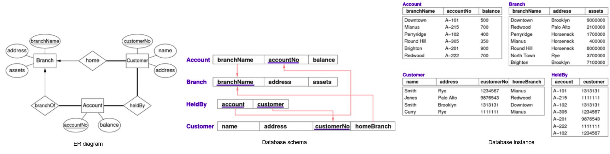

### Integrity Constraints

To represent real-world problems, we need to describe:

* what values are/aren't allowed
* what combinations of values are/aren't allowed

**Constraints** are logical statements that do this:

* **domain constraints** limit the set of values that attributes can take  
e.g. `Employee.age` attribute is typically defined as an `integer` often better modelled by having an extra constraint `15<age<66`
Note that `NULL` satisfies all domain constraints except `NOT NULL`
* **key constraints** identify attributes that uniquely identify tuples in a relation. A relation can have more than one key, so each key is a **candidate key**  
e.g. `Student(id,...)` is guaranteed to be unique, `Class(...,day,time,location,...)` is unique
* **entity integrity contraints** require keys to be fully-defined, that is no primary key value can be `NULL`  
e.g. `Class(...,Mon,2pm,Lyre)` is well-defined but `Class(...,NULL,2pm,Lyre,...)` is not well-defined
* **referential integrity constraints** require references to other tables to be valid. These references are known as **foreign keys**. A set of attributes F in R1 is a foreign key in R2 if:
    * the attributes in F correspond to the primary key of R2
    * the value of F in each tuple of R1 either occurs as a primary key in R2 or is entirely `NULL`

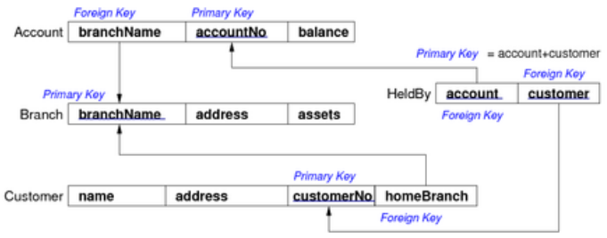

Foreign keys are critical in relational databases because they provide:

* the _glue_ that links individual relations (tables)
* the way to assemble query answers from multiple tables
* the relational representation of ER relationships

### Relational Databases

A **relational database schema** is a set of relation schemas {R1,R2,...,Rn} and a set of integrity constraints.  
A **relational database instance** is a set of relation instances {r1(R1), r2(R2),...,rn(Rn)} where all the integrity constraints are satisfied.  

One of the important functions of a relational DBMS is to ensure that all data in the database satisfies constraints. Changes to the data fail if they violate constraints.

We need a formalism, which is more detailed than boxes-and-arrows diagrams, to express relational schemas. SQL provides **Data Definition Language (DDL)** for this:

``` sql
CREATE TABLE TableName (
    attrName1 domain1 constraints1,
    attrName1 domain1 constraints1,
    ...
    PRIMARY KEY (attri,attrj,...)
    FOREIGN KEY (attrx,attry,...) REFERENCES OtherTable(attrm,attrn)
);
```

#### SQL Syntax in a Nutshell

Everything after `--` is a **comment**  
**Identifiers** are alphanumeric  
**Reserved words** include `CREATE`, `SELECT`, `TABLE` etc.  
**Strings** are in `'`: e.g. `'a string'`. There are no escape characters, but to escape `'` use it twice: `don''t ask`  
**Numbers** are like `C` numbers; e.g. `1`, `-5`, `3.14159` etc.  
Identifiers and reserved words are **case insensitive**; `TableName = tablename = TaBLeNamE != "TableName"`  
**Types**: `integer`, `float`, `char(n)`, `varchar(n)`, `date`, etc.  
**Operators**: `=`, `<>`, `<`, `<=`, `>`, `>=`, `AND`, `OR`, `NOT`, etc.

Sample SQL file representing multiple ways to define a schema:

``` sql
create domain CustNumType as
    char(7) check (value ~ '[0-9]{7}');

create table Branch (
    branchName  text,
    address     text unique not null,
    assets      integer check (assets > 100000),
    primary key (branchName)
);

create table Account (
--  'A-101', 'B-502' ... not 'XXX-3' 'hello' 'xxA-101!!'
--  accountNo   char(5) check (accountNo ~ '[A-Z]-[0-9]{3}'),
    accountNo   text check (accountNo ~ '^[A-Z]-[0-9]{3}$'),
    branchName  text,
    balance     integer check (balance >= 0),
--  Can you constrain that all branches have > $100000 in
--  constraint  bigbalance check (sum(balance) > 100000), ???
    primary key (accountNo),
    foreign key (branchName) references Branch(branchName)
);

create table Customer (
--  customerNo  char(7) check (customerNo ~ '[0-9]{7}'),
--  customerNo  integer check (customerNo::char(7) ~ '[0-9]{7}'), ???
--  customerNo  integer check (customerNo between 1000000 and 9999999),
    customerNo  CustNumType,
    name        text,
    address     text,
--  homeBranch  foreign key references Branch(branchName), ???
--  homeBranch  text foreign key references Branch(branchName),
    homeBranch  text,
    primary key (customerNo),
    foreign key (homeBranch) references Branch(branchName)
);

create table HeldBy (
    account     text,
    customer    CustNumType,
    primary key (account,customer),
    foreign key (account) references Account(accountNo),
    foreign key (customer) references Customer(customerNo)
);
```

## Mapping ER Designs to Relational Schemas

One useful strategy for database design is to:

1. perform initial data modelling using ER (conceptual-level modelling)
2. transform conceptual design into relational model (implementation-level modelling)

A formal mapping exists for ER models to relational models. This maps "structures" but additional information is needed such as constraints domain for attributes and other constraints.

A general correspondence between relational and ER data models is:

* ER: attribute becomes Relational: attribute
* ER: entity becomes Relational: tuple
* ER: entity set becomes Relational: relation
* ER: relationship becomes Relational: relation

The differences between relational and ER models is:

* Relational models use relations to model entities **and** relationships
* Relational models have **no composite or multi-valued attributes** only atomic attributes
* Relational models have **no object-oriented notions** such as subclasses or inheritance

### Mapping Strong Entities

An entity set E with atomic attributes a1, a2, ..., an maps to a relations R with attributes (columns) a1, a2, ..., an.

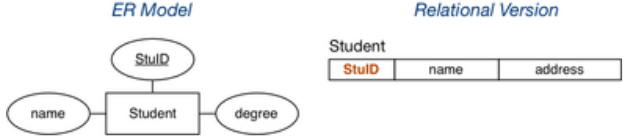

Note that the key is preserved in the mapping.

### Mapping Weak Entities

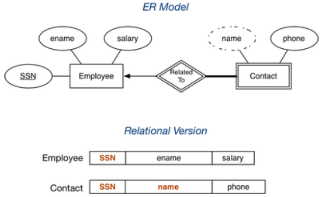

Note that the primary key of the strong entity and the descriminator in the weak entity combine to form the primary key of the weak entity.

### Mapping N:M Relationships

Many-to-many relationships can be mapped to a new relation, where the primary keys of entities involved in the relationship are foreign keys in this relations.

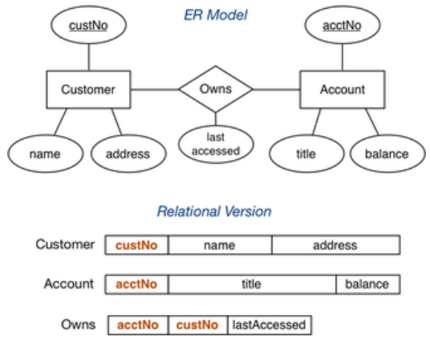

### Mapping 1:N Relationships

A one-to-many relationship can be mapped by having more values in one entity ~~or by mapping to a new relation.~~


**Be wary about the correctness of your mappings.**

For the first method, if we made branch store `customerNo` and `joined`, since each customer has one branch, the same branch will appear multiple times, violating the primary key. We cannot guarantee that we represented total participation on the customer entity.

The second method is incorrect because when using a new relation to represent the relationship, we are no longer able represent the cardinality of the relationship properly; the customer can have more than one branch (by appearing in multiple tuples) when it is only meant to have **one**

### Mapping 1:1 Relationships

When mapping one-to-one relationships, you will add relationship data to one entity/relation. Which relation you add it to depends on the participation of the relationship.

If one entity is totally participant in the relationship, the relationship data should be added to that entity. Otherwise we won't be able to _enforce_ the concept of total participation as we won't know whether all tuples have been used.

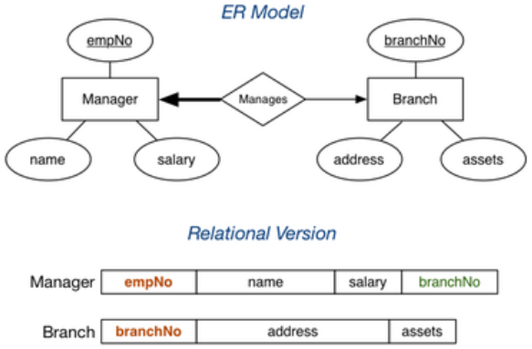

If we stored `empNo` in Branch, some branches will have `NULL` values in `empNo` since it is not compulsory for the branch to have a manager. On the other hand, the manager relation will always have a value for its `branchNo`

If there is no reason to favour one side of the relationship, it does not matter where the relationship data is placed.


### Mapping n-way Relationships

Our previous relationship mappings assume the relationships are binary.  
If multiple entities are involves:

* `n:m` generalises naturally to `n:m:p:q`
    * includes a foreign key for each participating entity
    * include any other attributes of the relationship
* other multiplicities (e.g. `1:n:m`) need to be mapped the same as `n:m:p:q` so they do not quite accurately reflect the mapping of the ER diagram

Some people advocate converting n-way relationships into a new entity and a set of _n_ binary relationships.

### Mapping Composite Values

Composite values can be stored as a single concatenated attribute or separate values.

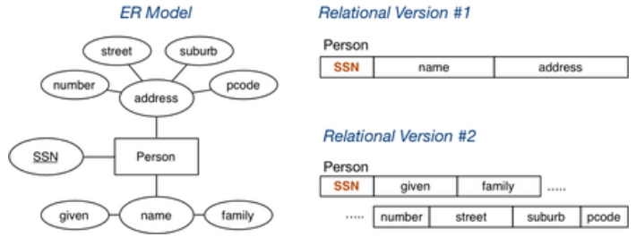

The first version has the advantage of being simpler and is useful if you don't intend to query or search the value.  
The second version has the advantage of being able to searched easily and precisely.

### Mapping Multi-valued Attributes

Multi-valued attributes are mapped by a new table linking values to their entity.

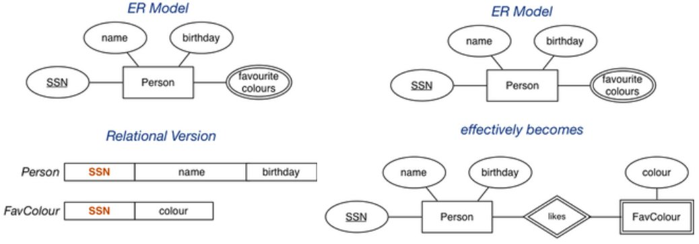

``` sql
-- the two entities
Person(12345, John, 12-feb-1990, [red,green,blue])
Person(54321, Jane, 25-dec-1990, [green,purple])
-- would be represented as
Person(12345, John, 12-feb-1990)
Person(54321, Jane, 25-dec-1990)
FavColour(12345, red)
FavColour(12345, green)
FavColour(12345, blue)
FavColour(54321, green)
FavColour(54321, purple)
```

### Mapping Subclasses

There are three different approaches to mapping subclasses to tables

* ER style - each entity becomes a separate table containing attributes of subclass and the foreign key of the super class; the use of separate tables means joins are required to get inherited attributes
* object-oriented - each entity becomes a separate tables containing inherited attributes from all superclasses; this results in redundancy however joins are not required
* single table with nulls - the whole class hierarchy becomes one tables containing all attributes of all subclasses, where unused values are set to `NULL`; this results in lots of `NULL` values which can be a waste of space

Which mapping is best depends on how the data is used

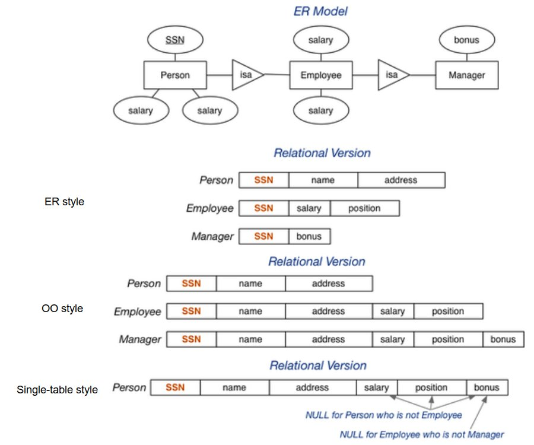

The different mappings also capture different aspects of subclasses:

* ER styles can't show disjoint subclasses and total participation. We can't guarantee a objects does not appear in another subclass.
* OO styles can't show disjoint subclasses but can show total participation. We can't guarantee a objects does not appear in another subclass.
* single table styles can show disjointed and overlapping subclasses and total participation if we define constraints properly. E.g. we have an attribute indicate which subclass an object belongs to. However we can't prevent a tuple from having a attribute from another subclass
