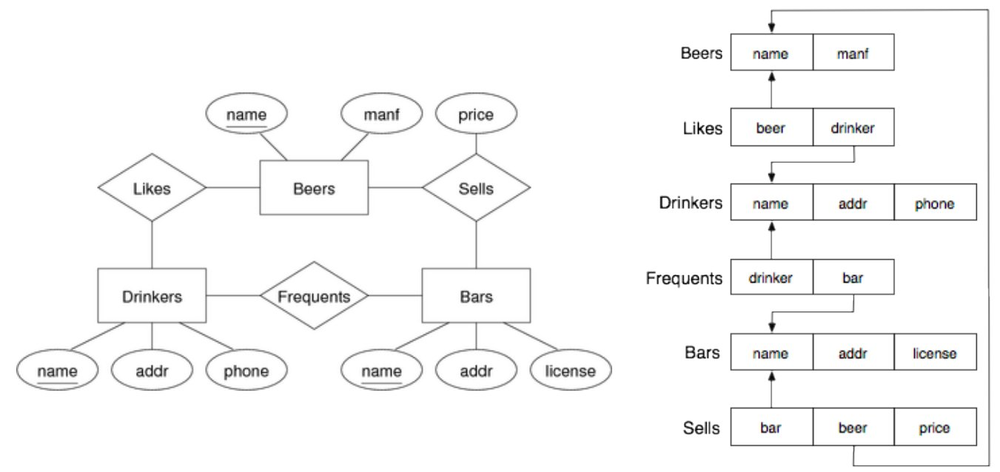

# RDBMS and SQL

## Relational DBMS

A **relational database management system (RDBMS)** is software:

* designed to support large-scale data-intensive applications
* allowing high-level description of data (tables, constraints)
* with high-level access to the data (relational model, SQL)
* providing efficient storage and retrieval (disk/memory management)
* supporting multiple simultaneous users (privilege, protection)
* doing multiple simultaneous operations (transactions, concurrency)
* maintaining reliable access to the stored data (backup, recovery)

Note: databases provide **persistent** storage of information

In COMP3311 we use:

* PostgreSQL - a full-featured, **client-server** DBMS, which is resource intensive
    * applications communicate via a server to the database
    * can run distributed and replicated
    * follows SQL standard closely, but not totally
    * has extra data types (e.g. JSON), multiple procedural languages
* SQLite - a full-featured, **serverless** DBMS, which is a light user of resources
    * is intended to be embedded in applications
    * follows SQL standard closely, but not totally
    * has no stored procedures, JSON, adds functions via programming languages


### Using PostgreSQL on CSE

Using your PostgreSQL server on CSE:

1. login to `grieg`  
`ssh grieg`
2. set up environment: see [lab02](https://cgi.cse.unsw.edu.au/~cs3311/20T1/pracs/02/index.php)
3. start server  
`pgs start`
4. use `psql` etc. to manipulate databases: see [lab02](https://cgi.cse.unsw.edu.au/~cs3311/20T1/pracs/02/index.php)
5. stop server  
`pgs stop`
6. log off `grieg`  
`logout` or `exit` or `ctrl-d`

Your PostgreSQL's home directory is located in `srvr/$USER/psql/data`.  
`/srvr/$USER/env` is where PostgreSQL's environment settings are stored
Under the home directory;

* `postgresql.conf` is the main configuration file
* `base/` is the subdirectory containing database files
* `postmaster.pid` is the process ID of the server process
* `.s.PGSQL.5432` is socket for clients to connect to the server
* `.s.PGSQL.5432.lock` is the lock file for the socket

## Building and Maintaining Databases

### Managing Databases

Shell commands to create and remove databases:

* `creatdb <dbname>` creates a new empty database
* `dropdb <dbname>` removes all data associated with a database

If no `dbname` is supplied, it assumes the database is called `$USER`

Shell commands to dump and restore database contents:

* `pg_dump <dbname> > <dumpfile>` to dump the database in `dumpfile`
* `psql <dbname> -f <dumpfile>` to restore the database from `dumpfile`

SQL statements used in `dumpfile`: `CREATE TABLE`, `ALTER TABLE`, `COPY`

### Managing Tables

SQL statements for managing tables:

* `CREATE TABLE table(attributes + constraints)` creates a table containing specified columns and constraints for columns if specified
* `ALTER TABLE table tableSchemaChanges` adds, deletes or modifies columns in an existing table
* `DROP TABLE table(s) [CASCADE]` removes table definitions and all data. Using `CASCADE` also drops objects which depend on the table. Objects could be tuples, view but not whole table.  
* `TRUNCATE TABLE table(s) [CASCADE]` removes **all rows** from a table. Using `CASCADE` will truncate tables which refer to the table

### Managing Tuples

SQL statements for managing tuples:

* `INSERT INTO tableName(col1, col2, ...) VALUES (col1_val1, col2_val1)[,(col1_val2, col2_val2), ...];`  
Note that you can insert multiple rows for the same columns
* `DELETE FROM tableName WHERE conditions;`
* `UPDATE tableName SET attrValueChanges WHERE conditions;` where `attrValueChanges` is a comma-separated list of `attrName=expression`

### Managing Objects

Databases contain objects other than tables and tuples; views, functions, sequences, types, indexes, roles etc.  
Most have SQL statements for:

* `CREATE ObjectType name ...`
* `DROP ObjectType name ...`

Views and functions also have available `CREATE OR REPLACE ObjectType name ...`

## SQL

**SQL** or **Structured Query Language** has several sub-languages:

* meta-data definition language (e.g. `CREATE TABLE`)
* meta-data update language (e.g. `ALTER TABLE`)
* data update language (e.g. `INSERT`,`UPDATE`,`DELETE`)
* query language (SQL) (e.g. (`SELECT`)

Meta-data languages manages the _schema_  
Data languages manipulate (sets of) _tuples_  
Query languages are based on _relational algebra_

### Types/Constants in SQL

**Numeric types**: `INTEGER`, `REAL`, `NUMERIC(w, d)`  
e.g. `10`, `-1`, `3.14159`, `2e-5`, `6.022e23`

**String types**: `CHAR(n)`, `VARCHAR(n)`, `TEXT`  
e.g. `John`, `some text`, `!%#%!$`, `O''Brien`, `"`, `[A-Z]{4}\d{4}`, `a VeRy! Long String`  
Note: the escape character in SQL is `'` hence the `''` in `O''Brien`

PostgreSQL provides extended strings containing `\` escapes  
e.g. `E'\n'`, `E'O\'Brien'`, `E'[A-Z]{4}\\d{4}'`, `E'John'`

**Typecasting** is also allowed via; `expr::type` e.g. `'10'::integer`

**Logical types**: `BOOLEAN`, `TRUE` and `FALSE` (or `true` and `false`)  
PostgreSQL also allows `t`, `true`, `yes`, `f`, `false`, `no`

**Time related types**: `DATE`, `TIME`, `TIMESTAMP`, `INTERVAL`  
e.g. `2008-04-13`, `13:30:15`, `2004-10-19 10:23:54`, `Wed Dec 17 07:37:16 1997 PST`, `10 minutes`, `5 days, 6 hours, 15 seconds`  
Subtraction of timestamps results in an interval. e.g. `now()::TIMESTAMP - birthdate::TIMESTAMP`

PostgreSQL also has a range of non-standard types such as  geometric (point/line/...), currency, IP addresses, JSON, XML, objectIDs, etc. Non-standard types typically use string literals (`'...'`) which need to be interpreted

Users can also define their own types in several ways:

``` sql
-- domains: constrained version of existing types
CREATE DOMAIN Name AS Type CHECK (Constraint);

-- tuple types: defined for each type
CREATE TYPE Name as (AttrName AttrType, ...);

-- enumerated types: specify elements and ordering
CREATE TYPE Name as ENUM ('Label', ...);
```

Values in enumerated (enum) types are ordered according to order of insertion so, 'small' < 'medium' < 'large'  
Values in domain stypes are ordered as for the underlying data type so, 'large' < 'medium' < 'small'

### Tuple and Set Literals

Tuples and set constants are both written as `(val1, val2, val3, ...)`  
The correct interpretation is worked out from the context.

Examples:

``` sql
-- tuple literal
INSERT INTO Student(studentID, name, degree) VALUES (2177364, 'Jack Smith', 'BSc');

-- set literal
CONSTRAINT CHECK gender in ('male', 'female');
```

### SQL Operators

**Comparison operators** are defined on all types: `<`, `>`, `<=`, `>=`, `=`, `<>`  
In PostgreSQL, `!=` is a synonym for `<>` but there is no `==`

**Boolean operators** `AND`, `OR` and `NOT` are also available, but note that `AND` and `OR` are not _short-circuit_ in the same way as C's `&&` and `||`

Most data types also have type-specific operations available

**String comparison**:  
`str1 < str2` compares using dictionary order  
`str LIKE pattern` matches string to pattern. Pattern matching uses SQL specific expressions:

* `%` matches anything (like `.*` in regex)
* `_` matches any single char (like `.` in regex)

Examples:

``` sql
name LIKE 'Ja%'     name beginning with 'Ja'
name LIKE '_i%'     name has 'i' as the second letter
name LIKE '%o%o%'   name contains two 'o's
name LIKE '%ith'    name ends with 'ith'
name LIKE 'John'    name equals 'John'
```

Many DBMSs also provide regexp-based pattern matching.  
PostgreSQL uses `~` and `!~` operators for this:  
`Attr ~ 'regexp'` or `Attr !~ 'regexp'`  
PostgreSQL also provides case-insensitive matching:  
`Attr ~* 'regexp'` or `Attr !~* 'regexp'`  
It also provide full-text searching

Examples of regex pattern matching:

``` sql
name ~ '^Ja'        name beginning with 'Ja'
name ~ '^.i'        name has 'i' as the second letter
name ~ '.*o.*o.*'   name contains two 'o's
name ~ 'ith$'       name ends with 'ith'
name ~ 'John'       name contains 'John'
```

Note: in terms of speed, logical operators (`=`, etc.) are faster than `LIKE` followed by regex pattern matching.  
regex is not part of the SQL standard however it is widely supported.

**String manipulation**:

* `str1||str2` returns the concatenation of `str1` and `str2`
* `lower(str)` returns the lowercase version of `str`
* `substring(str, start, count)` extracts a substring from `str`

Note the following:

* the above operations are null-preserving (strict). If any operand is `NULL` the result is `NULL`  
Beware of `<a>||' '||<b>`. It is null if either `a` or `b` is `NULL`
* SQL indexes start from `1` instead of `0`

**Arithmetic operators**:
`+`, `-`, `*`, `/`, `abs`, `ceil`, `floor`, `power`, `sqrt`, `sin`, etc  
_Aggregations_ "summarise" a column of numbers in a relations:

* `COUNT(attr)` gets the # of rows in `attr` column
* `SUM(attr)` sums the values of `attr`
* `AVG(attr)` gets the mean of values in `attr`
* `MIN()/MAX(attr)` gets the min/max value in `attr`

### The `NULL` Value

Expressions containing `NULL` generally yield `NULL`  
However, boolean expressions use three-valued logic:

| a       | b       | a AND b | a OR b  |
| :---:   | :---:   | :---:   | :---:   |
| `TRUE`  | `TRUE`  | `TRUE`  | `TRUE`  |
| `TRUE`  | `FALSE` | `FALSE` | `TRUE`  |
| `TRUE`  | `NULL`  | `NULL`  | `TRUE`  |
| `FALSE` | `FALSE` | `FALSE` | `FALSE` |
| `FALSE` | `NULL`  | `FALSE` | `NULL`  |
| `NULL`  | `NULL`  | `NULL`  | `NULL`  |

An important consequence of `NULL` behaviour is that the following expressions do not work as expected:  `x = NULL` and `x <> NULL`. Both return `NULL` regardless of the value of `x`. You can only test for `NULL` using `x IS NULL` and `x IS NOT NULL`

### Conditional Expressions

SQL provides other ways for dealing with `NULL`:

* `coalesce(val1, val2, ..., valn)` returns the first non-null value `vali`. It is useful for providing a "displayable" value for nulls.  
e.g. `select coalesce(mark, '??') from Marks ...;`
* `nullif(val1, val2)` returns `NULL` if `val1` is equal to `val2` and can be used to implement an inverse `coalesce`  
e.g.`nullif(mark, '??')`

SQL also provides generalised conditional expressions:

``` sql
CASE
    WHEN test1 THEN result1
    WHEN test2 THEN result2
    ...
    ELSE resultn
END

-- example
CASE
    WHEN mark >= 85 then 'HD'
    ...
    ELSE '??'
END
```

Tests that yield `NULL` are treated as `FALSE` If there is no `ELSE` and all test cases fail, `CASE` yields `NULL`

### SQL Queries

An SQL query consists of a sequence of clauses:

``` sql
SELECT      projectionList
FROM        relations/joins
WHERE       condition(s)
GROUP BY    groupingAttributes
HAVING      groupCondition;

-- FROM, WHERE, GROUP BY, HAVING clauses are optional
```

The result of a query is a relations, typically displayed as table. Results can be just one tuple with one attribute (i.e. one value) or even empty.

Example:

``` sql
-- Given the following schema:
Students(id, name, ...)
Enrolments(student, course, mark, grade)

-- Example SQL query:
SELECT      s.id, s.name, avg(e.mark) as avgMark
FROM        Students s, Enrolments e
WHERE       s.id = e.student
GROUP BY    s.id, s.name;
-- or --
SELECT      s.id, s.name, avg(e.mark) as avgMark
FROM        Students s
JOIN        Enrolments e on (s.id = e.student)
GROUP BY    s.id, s.name;
```

The query computes the following:

* produces all pairs of Students, Enrolments tuples which satisfy the condition `Students.id = Enrolments.student`
* each tuple has `(id, name, ..., student, course, mark, grade)`
* form groups of tuples with the same `(id, name)` values
* for each group, compute the average mark
* form result tuples `(id, name, avgMark)`

#### Joins

The general join structure:

``` sql
SELECT col1, t1.name, t2.name, colB
FROM table1 as t1
____ JOIN table2 as t2
ON t1.id = t2.id -- specify how to join tables
WHERE conditions
ORDER BY value;
```

Types of joins

* INNER - only return connected rows when there is a matching join
* RIGHT OUTER - will return **every** row from the right table even if there is no matching row
* LEFT OUTER - will return **every** row from the left table even if there is no matching row
* FULL OUTER - return **every** row from the left and right table. When the rows match they are connected, when they don't match they are still included with nulls in the non-matching columns
* CROSS - performs a cross product between two tables; connects each row from the first table with each row from the second table.

It is possible to join a table with itself using the joins above. This is known as a **self join**.

Example:

``` sql
-- Given this small database:
create table R (
  x  integer primary key,
  y  text
);

insert into R values (1,'abc');
insert into R values (2,'def');
insert into R values (3,'ghi');

create table S (
  z  char(1) primary key,
  x  integer references R(x)
);

insert into S values ('a',1);
insert into S values ('b',3);
insert into S values ('c',1);
insert into S values ('d',null);

-- select * from R natural join S;
x     y     z
1     abc   a
1     abc   c
3     ghi   b

-- select * from R join S on (R.x = S.x);
-- join means inner join (inner is optional and is the default)
x     y     z   x
1     abc   a   1
1     abc   c   1
3     ghi   b   3

-- select * from R, S where R.x = S.x;
x     y     z   x
1     abc   a   1
1     abc   c   1
3     ghi   b   3

-- select * from R left outer join S on (R.x = S.x);
-- outer not compulsory when left, right, and full are used
x     y     z   x
1     abc   a   1
1     abc   c   1
2     def
3     ghi   b   3

-- select * from R right outer join S on (R.x = S.x);
x     y     z   x
1     abc   a   1
1     abc   c   1
3     ghi   b   3
            d

-- select * from R full outer join S on (R.x = S.x);
x     y     z   x
1     abc   a   1
1     abc   c   1
2     def
3     ghi   b   3
            d
```

#### Problem-solving in SQL

**Aim**: starting with an informal request (i.e. an informal description of the information required from the database) we end up with a list of tuples that the requirements in the request.  
**Pre-requisite**: know your schema

Look for keywords in the request to identify required data. e.g:

* tell me the _names_ of all **students**...
* _how many_ **students** failed...
* what is the _highest mark_ in
* which **courses** are ... (course code?)

When developing SQL queries:

* relate required data to **attributes** in the schema
* identify which **tables** contain these attributes
* combine data from relevant tables (`FROM` , `JOIN`)
* specify conditions to select relevant data (`WHERE`)
* [optional] define grouping attributes (`GROUP BY`)
* develop expressions to compute output values (`SELECT`)

### Views

A **view** associates a name with a query via  
`CREATE VIEW viewName [(attributes)] AS query;`

Each time the view is invokes (in a `FROM` clause) the query is evaluated, yielding a set of tuples and the set of tuples is used as the values of the view.

A view can be treated as a  **virtual table**. They are useful for "packaging" a complex query to use in other queries.

Views can be defined by giving names to attributes

``` sql
create view V(a,b,c) as
select x, y, x from R where Condiion;
-- is the same as
create view V as
select x as a, y as b, z as c
from R where Condition;
```

Views can be redefined using `create or replace view V(a,b,c) as Query from R where condition;`  
Restrictions:

* the new view must have the same number of attributes as the old view
* attributes in the new view must be the same type as the old view

Otherwise:

``` sql
drop view V;
create view V(a,b,c) as Query;
```

An example covering most SQL topics:

We have the ER design for a beer database and its corresponding relational model:



Find the queries that can be used to answer the following questions on the beer database:

``` sql
-- 1. What beers are made by Toohey's?

select * from Beers where manf = 'Toohey''s';

-- 2. Show beers with headings "Beer" and "Brewer"

slect name as "Beer", manf as "Brewer" from Beers;

-- 3. How many different beers are there?

-- since name is the primary key for Beers, we know the beer names are unique
select count(name) from Beers;

-- 4. How many different brewers are there?

-- since brewers are not unique we need the 'distinct' keyword
select count(distinct manf) from Beers;

-- 5. (a) Which beers does John like?

-- the drinkers name is used as a foreign key so find beers in Likes which have 'John'
select beer from Likes where drinker = 'John';

-- 5. (b) Find the brewers whose beer John likes

-- approach 1: join Likes with Beer and filter
-- note: manufacturers are distinct because John may like beers made by the same brewer
select distinct b.manf
from Beers b join Likes l on l.beer = b.name
where l.drinker = 'John';

-- approach 2: use the previous query to get a set of beers
-- this approach is slower than using JOINS because for each beer in Beers
-- we need to check if it is in John's favourite beers
select distinct manf
from Beers
where name in (select beer from Likes where drinker = 'John');

-- note: JOINS are preferred over nested queries

-- 6. Find pairs of beers by the same manufacturer

-- use a self join
-- using b1.name < b2.name keeps results in (A,B) avoiding (A,A) and (B,A)
select b1.name, b2.name
from Beers b1 join Beers b2 on (b1.manf = b2.manf)
where b1.name < b2.name;

-- 7. (a) How many beers does each brewer make?

select manf as brewer, count(name) as nbeers
from Beers
group by manf;

-- 7. (b) Which brewers make only one beer?

create or replace view nb(brewer, nbeers) as
select manf, count(name)
from Beers
group by manf;

select brewer from nb where nbeers = 1;

-- 7. (c) Find beers that are the only one made by their brewer

select b.beer
from Beers b join nb on (nb.brewer = b.manf)
where nb.nbeers = 1;

-- 8. Find beers sold at bars where John drinks

select distinct s.beer
from Frequents f join Sells s on (f.bar = s.bar)
where f.drinker = 'John';

-- alternative solution using nested queries
select beer
from   Sells
where  bar in (select bar from frequents where drinker='John');

-- 9. Which brewer makes the most beers?

create view BrewerBeers(brewer, nbeers) as
select manf, count(name)
from Beers
group by manf;

select brewer
from BrewerBeers
where nbeers = (select max(nbeers) from BrewerBeers);

-- 10. Bars where either Gernot or John drinks

select distinct bar from Frequents where drinker = 'Gernot' or drinker ='John';
-- or
select distinct bar from Frequents where drinker in ('Gernot', 'John');
-- or
(select bar from frequents where drinker='Gernot')
union
(select bar from frequents where drinker='John');

-- 11. Bars where both Gernot and John drinks

-- WRONG: select bar from frequents where drinker='Gernot' and drinker='John';

-- using intersect
(select bar from Frequents where drinkers = 'Gernot')
intersect
(select bar from Frequents where drinkers = 'John');

-- using joins
select d1.bar, d1.drinker, d2.drinker
from Frequents d1 join Frequents d2 on (d1.bar = d2.bar)
where d1.drinker = 'Gernot' and d2.drinker = 'John';

-- 12. Find bars that server New at the same price as the Coogee Bay Hotel charges for VB

-- find the price that CBH charges for VB
crete or replace view CBH_VB_price as
select price
from Sells
where bar = 'Coogee Bay Hotel' and beer = 'Victoria Bitter';

select bar
from Sells
where price = (select price from CBH_VB_price) and bar <> 'Coogee Bay Hotel';

-- 13. Find the average price of common beers (i.e. served in more than two hotels)

-- create a view of common beers
create or replace view CommonBeers as
select beer
from Sells
group by beer
having count(bar) > 2;

-- then use avg() to determine the average price per beer
select beer, avg(price)::numeric(5,2) as "AvgPrice"
from Sells
where beer in (select * from CommonBeers)
group by beer;

-- 14. Which bar sells 'New' cheapest

-- find cheapest price New is sold for
select min(price) from Sells where beer = 'New';

-- then find the Sells record that has the price
select bar
from Sells
where beer = 'New' and price = (select min(price) from Sells where beer = 'New');

-- 15. Which bar is the most popular? (most drinkers)

create view Popularity(bar, ndrinkers) as
select bar, count(drinker)
from Frequents
group by bar;

select bar
from Popularity
where ndrinkers = (select max(ndrinkers) from Popularity);

-- 16. Which bar is most expensive (Maximum average price)

create view AvgPrice(bar, avgPrice) as
select bar, avg(price)
from   Sells
group  by bar;

select bar
from   AvgPrice
where  avgPrice = (select max(avgPrice) from AvgPrice);

-- 17. Which beers are sold at all bars?

-- Basic approach:
-- for each beer b {
--     BB = set of bars where b is sold
--     AB = set of all bars
--     if (AB == BB) then b is sold at all bars
-- }

-- "foreach beer b" is implemented as:

-- select name
-- from   Beers b
-- where  some-Condition-Involving-b

-- Unfortunately, SQL does not have set equality
-- but it does have set difference and empty set check
-- so rephrase above test as
--
--     if (isEmpty(AB - BB)) then b is sold at all bars

-- Soln:

select name
from   Beers b
where  not exists (                                  -- isEmpty
        (select name from Bars)                      -- AB
        except                                       -- set diff
        (select bar from Sells where beer = b.name)  -- BB
       );

-- 18. Price of cheapest beer at each bar?

create view Cheapest(bar, price) as
select bar, min(price)
from   Sells
group  by bar;

select * from   Cheapest;

-- 19. Name of cheapest beer at each bar?

select s.*
from   Sells s
where  s.price = (select price from Cheapest where bar = s.bar);

-- 20. How many drinkers are in each suburb?

create view DrinkerPlaces(suburb,ndrinkers) as
select addr, count(*)
from   Drinkers
group  by addr;

-- 21. How many bars in suburbs where drinkers live? (Must include suburbs with no bars)

select d.addr, count(b.name)
from   Drinkers d left outer join Bars b on (d.addr = b.addr)
group  by d.addr;
```

## Extending SQL

What we have seen of SQL so far:

* data definition language (`create table()`)
* constraints (domain, key, referential integrity)
* query language (`select...from...where...`)
* views (give names to SQL queries)

This is not sufficient tto write complete applications. More _extensibility_ and _programmability_ are needed.

Standard SQL may be extended via the following:

* new data types (including constraints, I/O, indexes, etc.)
* object-orientation
* more powerful constraint checking
* packaging/parameterising queries
* more functions/aggregates for use in queries
* event-based triggered actions

All are required to assist in application development.
