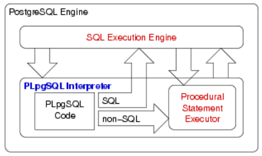

# Programming in SQL

SQL is a powerful language for manipulating relational data, but it is **not** a powerful programming language.  
At some point in developing complete data base applications, we need to:

* implement user interactions
* control sequences of database operations
* process query results in complex ways

and SQL cannot do any of these.

## Database Programming

Database programming requires a combination of

* manipulation of data in databases (via SQL)
* conventional programming (via procedural code)

This combination is realised in a number of ways:

* passing SQL commands via a "call-level" interface (the programming language is decoupled from DBMS; most flexible; e.g. Java/JDBC, PHP)
* embedding SQL into augmented programming languages (requires pre-processor for languages; typically DBMS-specific; e.g. SQL/C)
* special-purpose programming languages in DBMS (closely integrated with DBMS; enable extensibility; e.g. PL/SQL, PLpgSQL)

Combining SQL and procedural code solves the "withdrawal" problem  
Using SQL/PSM syntax:

``` sql
create function withdraw(acctNum text, amount integer) returns text
declare bal integer;
begin
    set bal = (select balance from Accounts where acctNo = acctNum);
    if (bad < amount) then
        return 'Insufficent Funds';
    else
        update Accounts
        set balance = balance - amount
        where acctNo = acctNum;
        set bal = (select balance from Accounts where acctNo = acctNum)
        return 'New Balance: '||bal;
    end if
end;
```

### PostgreSQL Stored Procedures

PostgreSQL syntax for defining stored functions:

``` sql
CREATE OR REPLACE FUNCTION funcNum(arg1, arg2, ...) RETURNS retType
AS $$
    String containing function definition
$$ LANGUAGE funcDefLanguage;

-- Note:
-- * argi consists of: name type
-- * $$...$$ are just another tpe of string quote
-- * function defintion languages: SQL, PLpgSQL, Python
```

The PLpgSQL interpreter executes procedural code and manages variables. It calls PostgreSQL engine to evaluate SQL statements.



### Function Return Types

A PostgreSQL function can return a value which is:

* `void` (i.e. no return value)
* an atomic data type (e.g. `integer`, `text`, etc.)
* a tuple (e.g. table record type or tuple type)
* a set of atomic values (like a table column)
* a set of tuples (like a table)

A function returning a set of values is similar to a view.

Examples of different function return types:

``` sql
create function factorial(integer) returns integer...
create function EmployeeOfMonth(date) returns Employee...
create function allSalaries() returns setof float...
create function OlderEmployees() returns setof Employee...
```

Different kinds of functions are invoked in different ways:

``` sql
select factorial();                             -- returns one integer
select EmployeeOfMonth('2008-04-01');           -- returns (x,y,z)
select * from EmployeeOfMonth('2008-04-01');    -- one-row table
select * from allSalaries();                    -- single-column table
select * from OlderEmployees();                 -- subset of Employees
```

### SQL Functions

PostgreSQL allows functions to be defined in SQL:

``` sql
CREATE OR REPLACE funcName(arg1 type, arg2 type, ...) RETURNS retType
AS $$
    SQL statements
$$ LANGUAGE sql
```

Within the function, arguments are accessed as `$1`, `$2` ...  
The return value is the result of the last SQL statement  
`retType` can be any PostgreSQL data type (including tuples and tables)  
For a function to return a table, use: `return setof TupleType`

Examples:

``` sql
-- max price of specified beer
create or replace function maxPrice(text) returns float
as $$
    select max(price) from Sells where beer = $1;
$$ language sql;

-- usage examples
select maxPrice('New');
maxprice
----------
2.8

select bar,price from sells where beer='New' and price=maxPrice('New');
bar         | price
------------+-------
Marble Bar  | 2.8

-- set of Bars from specified suburb
create or replace function hotelsIn(text) returns setof Bars
as $$
    select * from Bars where addr = $1;
$$ language sql;

-- usage examples
select * from hotelsIn('The Rocks');
name            | addr      | license
----------------+-----------+---------
Australia Hotel | The Rocks | 123456
Lord Nelson     | The Rocks | 123888
```

### Functions vs. Views

A parameterless function behaves similar to a view

Let us compare a view and function which do the same thing

``` sql
create or replace view EmpList(name, addr) as
select family||' '||given, street||', '||town, from Employees;

-- which is used as
select * from EmpList;

create type EmpRecord as (name text, addr text);

create or replace function EmpList() returns setof EmpRecord
as $$
    select family||' '||given, street||', '||town, from Employees;
$$ language sql

-- which is used as
select * from EmpList();
```

## PLpgSQL

PLpgSQL or Procedural Language extensions to PostgreSQL integrate features of a procedural programming language and SQL programming.  
It provides a means of _extending DBMS functionality_ e.g:

* implementing constraint checking (trigger functions)
* complex query evaluation (e.g recursion)
* complex computation of column values
* detailed control of displayed results

### Defining PLpgSQL Functions

PLpgSQL functions are created (and inserted into databases) via:

``` sql
CREATE OR REPLACE funcName(param1, param2, ...) RETURN retType
AS $$
DECLARE
    variable declarations
BEGIN
    code for function
END:
$$ LANGUAGE plpgsql
-- Note the entire function body is a single SQL string
```

Example: a function to return 2n, for a given n

``` sql
create or replace double(n integer) returns integer
as $$
declare
    res integer;
begin
    res := 2*n;
    return res;
end;
$$ language plpgsql;

--or, more simply
... $$
begin
return 2*n;
end;
$$ ...
```

Example: create a function ("a","b") which produces "a'b"

``` sql
--new-style function
CREATE OR REPLACE FUNCTION cat(x text, y text) RETURNS text
as $add$
DECLARE
    result text; -- local variable
BEGIN
    result := x||''''||y;
    return result;
END;
$add$ LANGUAGE plpgsql;

-- Note: NEVER give parameters the same name as an attribute
-- a strategy to counter this would be to
-- start all parameter names with an underscore

-- old-style function
CREATE OR REPLACE FUNCTION cat(text, text) RETURNS text
as '
DECLARE
    x alias $1;  -- alias for parameter
    y alias $2;  -- alias for parameter
    result text; -- local variable
BEGIN
    result := x||''''''''||y;
    return result;
END;
' LANGUAGE plpgsql;
```

Example: a solution to our "withdrawal" problem in PLpgSQL

``` sql
create function withdraw(acctNum text, amount integer) returns text
as $$
declare bal integer;
begin
    set bal = (select balance from Accounts where acctNo = acctNum);
    if (bad < amount) then
        return 'Insufficent Funds';
    else
        update Accounts
        set balance = balance - amount
        where acctNo = acctNum;
        set bal = (select balance from Accounts where acctNo = acctNum)
        return 'New Balance: '||bal;
    end if;
end;
$$ langauge plpgsql;
```

### PLpgSQL Gotchas

Some things to be aware of:

* does not provide any I/O facilities (except `RAISE NOTICE`); the aim is to build complex computations on tables that SQL alone cannot do
* functions are not syntax-checked when loaded into the database; you don't find out about the syntax error until 'run-time'
* error messages are sometimes not particularly helpful
* functions are defined as strings; change of _lexicographical scopre_ can sometimes be confusing
* giving params/variables the same name as attributes

In general, debugging PLpgSQL can sometimes be tricky

### PLpgSQL Data Types

PLpgSQL constants and variables can be defined using:

* standard SQL data types (`CHAR`, `DATE`, `NUMBER`, etc.)
* user-defined PostgreSQL data types (e.g. `Point`)
* a special structured record type (`RECORD`)
* table-row types (e.g. `Branches%ROWTYPE`)
* types of existing variables (e.g. `Branches.location%TYPE`)

There is also a `CURSOR` type for interacting with SQL.

Variables can also be defined in terms of:

* the type of an existing variable or table column
* the type of an existing table row (implicit `RECORD` type)

Examples:

``` sql
quantity    INTEGER;
start_qty   quantity%TYPE;
employee    Employees%ROWTYPE;
name        Employees.name%TYPE;
```

### PLpgSQL Syntax and Control Structures

A standard assignment operator is available

``` sql
-- Assignment
var := expr
SELECT expr INTO var

-- Selection
IF c1 THEN s1
ELSIF c2 THEN s2
ELSE s END IF

-- Iteration
LOOP s END LOOP
WHILE c LOOP s END LOOP
FOR rec_var IN query LOOP ...
FOR int_var IN lo..hi LOOP ...
```

### SELECT ... INTO

We can capture query results via:

``` sql
SELECT Exp1, Exp2,...,Expn
INTO Var1, Var2,...,Varn
FROM TableList
Where Conditions...
```

The semantics execute the query as usual, return a 'projection list' (Exp1,Exp2,...) as usual and assign each Expri to a corresponding Vari.

Assigning a simple value via `SELECT...INTO`:

``` sql
-- cost is local var, price is attr
SELECT price INTO cost
FROM StockList
WHERE item = 'Cricket Bat';
cost := cost * (1+tax_rate);
total := total + cost;
```

The current PostgreSQL parser also allows this syntax:

``` sql
SELECT INTO cost price
FROM StockList
WHERE item = 'Cricket Bat';
```

Assigning whole rows via `SELECT...INTO`:

``` sql
DECLARE
    emp Employees%ROWTYPE;
    eName text;
    pay real;

BEGIN
    SELECT * INTO emp
    FROM Employees WHERE id = 966543;
    eName := emp.name;
    ...
    SELECT name,salary INTO eName,pay
    FROM Employees WHERE id = 966543;
END;
```

In the case of a PLpgSQL statement like `select a into b from R where ...`  
If the selection returns no tuples the variable b gets the value `NULL`
If the selection returns multiple tuples the variable b gets the value from the first tuple

An alternative to check for "no data found" is to use the special variable `FOUND`. It is:

* local to each function, set false at start of function
* set true if a `SELECT` finds at least one tuple
* set true if `INSERT`/`DELETE`/`UPDATE` affects at least one tuple
* otherwise, remains as `FALSE`

Example of use:

``` sql
select a into b from R where ...
if (not found) then
-- handle case where no matching tuples b
```

### Recursion and Iteration

PLpgSQL is a programming language: containing variables, assignment, conditionals, loops, functions combined with database interactions (via SQL) functions are stored in the databased and invoked from SQL.

Example: a factorial function in PLpgSQL

``` sql
-- an iterative approach
create or replace function
    faci(n integer) returns numeric
as $$
declare
    i numeric;
    f numeric := 1;
begin
    for i in 1..n
    loop
        f := f * i;
    end loop;
    return f;
end;
$$ language plpgsql;

-- a recursive approach
create or replace function
    facr(n integer) returns integer
as $$
declare
    i integer;
    f integer := 1;
begin
    if (n <= 1) then
        return 1;
    else
        return n * facr(n-1);
    end if;
end;
$$ language plpgsql;
```

### Debugging Output

Depending on how PostgreSQL is configured `raise notice` allows you to display information from a function. The output is displayed in the `psql` window during the function's execution.  
Usage: `raise notice 'String with % symbols', value1, ..., valuen;`

``` sql
create or replace function
    showi(n integer) returns void
as $$
declare
    i integer;
begin
    for i in 1..n
    loop
        raise notice 'Next value is %',i;
    end loop;
end;
$$ language plpgsql;
```

### Returning Multiple Values

PLpgSQL functions can return a `setof` values, which is effectively a function returning a table. The values could be atomic like a single column, or they could be tuples like a full table.

Atomic types include: `integer`, `float`, `numeric`, `date`, `text`, `varchar(n)`  
Tuple types can be declared like this:

``` sql
create type Point as (x float, y float);
create type Student as (id integer, name text, degree text, wam float, ...);
```

Example function returning a set of tuples

``` sql
create type MyPoint as (x integer, y integer);
create or replace function
    points(n integer, m integer) returns setof MyPoint
as $$
declare
    i integer; j integer;
    p MyPoint; -- tuple variable
begin
    for i in 1 .. n loop
        for j in 1 .. m loop
            p.x := i; p.y := j;
            return next p;
        end loop;
    end loop;
end;
$$ language plpgsql;
```

### Query Results in PLpgSQL

We can evaluate a query and iterate through its results one tuple at a time using a `for..loop`.

``` sql
create or replace function
    well_paid(_minsal integer) returns integer
as $$
declare
    nemps integer := 0;
    tuple record;
begin
    for tuple in select * from Employees where salary > _minsal
    loop
        nemps := nemps + 1;
    end loop;
    return nemps;
end;
$$ language plpgsql;

-- an alternative but less efficient solutions would have the loop like this:
for tuple in select * from Employees
loop
    if (tuple.salary > _minsal) then
    end if;
end loop;
```

### INSERT ... RETURNING

We can capture values from tuples inserted into the database by using `insert ... returning`

Usage:

``` sql
insert into Table(...) values (val1, val2, ..., valn)
returning ProjectionList into VarList;
```

Example:

``` sql
declare newid intger; colour text;
...
insert into T(id,a,b,c) values(default,2,3,'red')
returning id,c into newid,colour;
-- id contains the primary key value for the new tuple T(?,2,3,'red')
```
