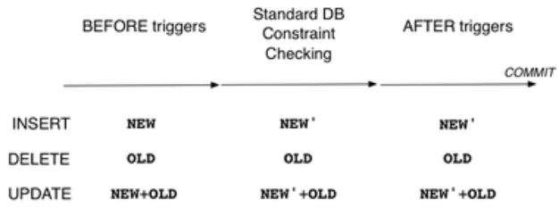
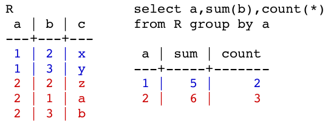

# More PLpgSQL

## Constraints

So far we have looked at several kinds of constraints:

* **attribute** (column) constraints
* **relation** (table) constraints
* **referential integrity** constraints

``` sql
create table Employee (
    id integer primary key,                     -- 'primary key' is a referential integrity constraint
    name varchar(40),
    salary real,
    age integer check (age > 15),
    worksIn intege
        references Department(id),              -- referential integrity constraint
    constraint PayOk check (salary > age*1000)  -- relation constraint
);
-- all type declarations also count as constraints
```

Column and table constraints ensure validity of **one** table.  
Referential integrity constraints ensure connections between tables are valid.

However, specifying the validity of an entire database often requires constraints involving multiple tables.

Example: we want to ensure the assets of a branch is the sum of balances of accounts held at the branch

``` sql
for all Branches b
    b.assets = (select sum(acct.balance)
                from Accounts acct
                where acct.branch = b.location)
```

### Assertions

**Assertions** are schema-level constraints. They typically involve multiple tables and express a condition which **must hold at all times**. They need to be check on each change to relevant tables. If a change would cause the check to fail, the change is rejected.

SQL syntax: `CREATE ASSERTION name CHECK (condition)`  
The condition is expressed as "there are no violations in the database"  
The implementation involves asking a query to find all violations, and checking for an empty result

Example: the # of students in any UNSW course must be <10000

``` sql
create assertion ClassSizeConstraint check (
    not exists (
        select c.id from Courses c, CourseEnrolments e
        where c.id = e.course
        group by c.id having count(e.student) > 9999
    )
);
```

Example: the asset of a bank branch is equal to the sum of its account balances

``` sql
create assertion AssetCheck check (
    not exists (
        select branchName from branches b
        where b.assets <>
            (select sum(a.balance) from Accounts a
             where a.branch = b.location)
    )
);
```

On each update, it is expensive to:

* determine which assertions need to be checked
* run the queries which check the assertions

A database with many assertions would be way too slow, so most RDBMSs do not implement general assertions.

### Triggers

Instead of assertions, triggers are provided as a lightweight mechanism for dealing with assertions. They are a general event-based programming tool for databases.

**Triggers** a procedures stored in the database that are activated in response to database events such as `insert` and `update`

Example uses of triggers include:

* maintaining summary data
* checking schema-level constraints (assertions) on updated
* performing multi-table updates (to maintain assertions)

Triggers provide event-condition-actions (ECA) programming.  

1. An _event_ activates the trigger.
2. On activation the trigger checks a condition.
3. If the condition holds, a procedure is executed (the action)

Some typical variations on this:

* execute the action before, after or instead of the triggering event
* can refer to both old and new values of updated tuples
* can limit updated to a particular set of attributes
* perform action: for each modified tuple, once for all modified tuples

SQL "standard" syntax for defining triggers:

``` sql
CREATE TRIGGER TriggerName
{AFTER|BEFORE} Event1 [OR Event2 ...]
[FOR EACH ROW]
ON TableName
[WHEN (Condition)]
Block of Procedural/SQL Code;
```

Possible events are `INSERT`, `DELETE`, `UPDATE`

`FOR EACH ROW` clause:

* if present, the code is executed on each modified tuple
* if not present, code is executed on after all tuples are modified, just before the changes are finally `COMMIT`ted

#### Trigger Semantics

Triggers can be activated `BEFORE` or `AFTER` the event.

If activated `BEFORE`, it can affect the change that occurs:

* `NEW` contains "proposed" value of a changed tuple
* modifying `NEW` causes a different value to be placed in the database

If activated `AFTER`, the effects of the event are visible:

* `NEW` contains the current value of the changed tuple
* `OLD` contains the previous value of the changed tuple
* constraint checking has been done for `NEW`

Note: `OLD` does not exist for insertion and `NEW` does not exist for deletion.

Sequence of activities during database update:



Reminder: `BEFORE` can modify the value of a new tuple

Consider two triggers and an **INSERT** statement:

``` sql
create trigger X before insert on T Code1;
create trigger Y after insert on T Code2;
insert into T values (a,b,c,...);
```

Sequence of events:

1. execute `Code1` for trigger `X`
2. code has access to `(a,b,c,...)` via `NEW`
3. code typically checks the values of `a,b,c,...`
4. code can modify values of `a,b,c,...` in `NEW`
5. DBMS does constraint checking as if `NEW` is inserted
6. if fails any checking, abort insertion and rollback
7. execute `Code2` for trigger `Y`
8. code has access to final version of tuple via `NEW`
9. code typically does final checking, or modifies other tables in database to ensure constraints are satisfied

Consider two triggers and an **UPDATE** statement:

``` sql
create trigger X before update on T Code1;
create trigger Y after update on T Code2;
update T set b=j,c=k where a=m;
```

Sequence of events:

1. execute `Code1` for trigger `X`
2. code has access to current version of tuple via `OLD`
3. code has access to updated version of tuple via `NEW`
4. code typically checks the new values of `b,c,...`
5. code can modify values of `a,b,c,...` in `NEW`
6. do constraint checking as if `NEW` has replaced `OLD`
7. if fails any checking, abort update and rollback
8. execute `Code2` for trigger `Y`
9. code has access to final version of tuple via `NEW`
10. code typically does final checking, or modifies other tables in database to ensure constraints are satisfied

Consider two triggers and an **DELETE** statement:

``` sql
create trigger X before delete on T Code1;
create trigger Y after delete on T Code2;
delete from T where a=m;
```

Sequence of events:

1. execute `Code1` for trigger `X`
2. code has access to `(a,b,c,...)` via `OLD`
3. code typically checks the values of `a,b,c,...`
4. DBMS does constraint checking as if `OLD` is removed
5. if fails any checking, abort deletion, restore `OLD`
6. execute `Code2` for trigger `Y`
7. code has access to about-to-be-deleted tuple via `OLD`
8. code typically does final checking, or modifies other tables in database to ensure constraints are satisfied

#### Triggers in PostgreSQL

PostgreSQL triggers provide a mechanism for `INSERT`, `DELETE` or `UPDATE` events to automatically activate PLpgSQL functions.

Syntax for PostgreSQL trigger definition:

``` sql
CREATE TRIGGER TriggerName
{AFTER|BEFORE} Event1 [OR Event2 ...]
ON TableName
[ WHEN ( Condition ) ]
FOR EACH {ROW|STATEMENT}
EXECUTE PROCEDURE FunctionName(args...);
```

There is no restriction on what code can go in the function. However, a `BEFORE` function must contain one of `RETURN old;` or `RETURN new;` depending on which version of the tuple is to be used.  
If `BEFORE` trigger returns `old`, no changes occur  
If an exception is raised in a trigger function, no changes occur

Example: Ensure only valid state codes are used in a database people in USA

``` sql
create table Person (
    id integer primary key,
    ssn varchar(11) unique,
    -- ... e.g. family, given, street, town ...
    state char(2), ...
);

create table States (
    id integer primary key,
    code char(2) unique,
    --... e.g. name, area, population, flag ...
);
-- Constraint: Person.state ∈ (select code from States), or exists (select id from States where code=Person.state)

create trigger checkState before insert or update
on Person for each row execute procedure checkState();

create function checkState() returns trigger as $$
begin
    -- normalise the user-supplied value
    new.state = upper(trim(new.state));
    if (new.state !~ '^[A-Z][A-Z]$') then
        raise exception 'Code must be two alpha chars';
    end if;

    -- implement referential integrity check
    select * from States where code=new.state;
    if (not found) then
        raise exception 'Invalid code %',new.state;
    end if;
    return new;
end;
$$ language plpgsql;

insert into Person
values('John',...,'Calif.',...);
-- fails with 'Statecode must be two alpha chars'

insert into Person
values('Jane',...,'NY',...);
-- insert succeeds; Jane lives in New York

update Person
set town='Sunnyvale',state='CA'
where name='Dave';
-- update succeeds; Dave moves to California

update Person
set state='OZ' where name='Pete';
-- fails with 'Invalid state code OZ'
```

Example: department salary totals

Given

``` sql
Employee(id, name, address, dept, salary, ...)
Department(id, name, manager, totSal, ...)
```

An assertion that we wish to maintain:

``` sql
create assertion TotalSalary check (
    not exists (
        select d.id from Department d
        where d.totSal <>
            (select sum(e.salary)
             from Employee e
             where e.dept = d.id)
    )
)
```

Events that might affect the validity of the database

* a new employee starts work in some department
* an employee gets a rise in salary
* an employee changes from one department to another
* an employee leaves the company

A single assertion could check for this after each change.  
With triggers, we have to program each case separately.  
Each program implements updates to ensure assertion holds.

``` sql
-- case 1: new employee arrives
create trigger TotalSalary1
after insert on Employees
for each row execute procedure totalSalary1();

create function totalSalary1() returns trigger
as $$
begin
    if (new.dept is not null) then
        update Department
        set
        totSal = totSal + new.salary
        where Department.id = new.dept;
    end if;
    return new;
end;
$$ language plpgsql;

-- case 2: employees change department/salaries
create trigger TotalSalary2
after update on Employee
for each row execute procedure totalSalary2();

create function totalSalary2() returns trigger
as $$
begin
    update Department
    set
    totSal = totSal + new.salary
    where Department.id = new.dept;

    update Department
    set
    totSal = totSal - old.salary
    where Department.id = old.dept;

    return new;
end;
$$ language plpgsql;

-- case 3: employee leaves
create trigger TotalSalary3
after delete on Employee
for each row execute procedure totalSalary3();

create function totalSalary3() returns trigger
as $$
begin
    if (old.dept is not null) then
        ut
pdate Department
        set
        totSal = totSal - old.salary
        where Department.id = old.dept;
    end if;
    return old;
end;
$$ language plpgsql;
```

## Exceptions

PLpgSQL supports exception handling via

``` sql
begin
    Statements ...
exception
    when Exceptions1 then
        StatementForHandler1
    when Exceptions2 then
        StatementForHandler2
    ...
end;
```

Each Exceptionsi is an `OR` list of exception names e.g. `division_by_zero OR floating_point_exception OR ..`

When an exception occurs:

* control is transferred to the relevant exception handling code
* all database changes so far in this transaction are undone
* all function variables retain their current values
* handler executes and then the transaction aborts (and function exits)

If there is no handler in the current scope, the exception is passed to next outer level.  
The default exception handlers at the outermost level exit and log error.

Example of exception handling:

``` sql
-- table T contains one tuple ('Tom', 'Jones')
declare
    x integer := 3;
begin
    update T set firstname = 'Joe'
    when lastname = 'Jones';
    -- table T now contains ('Joe', 'Jones')
    x := x + 1;
    y := y / 0;
exception
    when division_by_zero then
        -- update on T is rolled back to ('Tom', 'Jones')
        raise notice 'caught division_by_zero';
        return x; -- return may or may not work here
                  -- if it does, the value returned is 4
end;
```

The `raise` operator can generate server log entries. e.g.

``` sql
raise debug 'Simple message';
raise notice 'User = %', user_id;
raise exception 'Fatal: value was %', value;
```

There are several levels of severity: `DEBUG`, `INFO`, `NOTICE`, `WARNING`, and `EXCEPTION`  
Not all severities generate a message to the client. `client_min_messages` shows which level of severity an entry must be to log to output. You can view and change the level using `show client_min_messages;` and `set client_min_messages to <level>` respectively.

Server log files can grow _very_ large and are deleted when you shut your server down.

The CSE server log file is `srvr/$USER/pgsql/Log`.

## Dynamically Generated Queries

`EXECUTE` takes a string and executes it as an SQL query.

Examples:

``` sql
execute 'select * from Employees';
execute 'select * from '||'Employees';
execute 'select * from '||quote_ident($1);
execute 'delete from Accounts '||'where holder='||quote_literal($1);
```

This can be used in any context where an SQL query is expected. It is also a mechanism that allows us to _construct_ queries "on the fly".

Example: a wrapper for updating a single text field

``` sql
create or replace function
    set(_tab text, _attr text, _val text) returns void
as $$
declare
    query text;
begin
    query := 'update' || quote_ident(_tab);
    query := query || ' SET ' || quote_ident(_attr);
    query := query || ' = ' || quote_literal(_val);
    EXECUTE query;
end;
$$ language plpgsql;

-- which can be used as
select set('branches', 'address', 'Beach St.');
```

The one limitation of `EXECUTE` is that you cannot used `select ... into ...` inside dynamic queries. Instead it needs to be expressed as:

``` sql
declare tuple R&rowtype'; n int;
execute 'select * from R where id='||n into tuple;
-- or
declare x int; y int; z text;
execute 'select a,b,c from R where id='||n into x,y,z;
-- Note:
-- if a query returns multiple tuples, the first one is stored
-- if a query returns zero tuples, all nulls are stored
```

## Aggregates

**Aggregates** reduces a collection of values into a single result. e.g: `count(Tuples)`, `sum(Tuples)`, `max(AnyOrderedType)`

The action of an aggregate function can be viewed as:

``` sql
State = initial state
for each item V {
    # update State to include V
    State = updateState(State, V)
}
return makeFinal(State)
```

Aggregates are commonly used with `GROUP BY`. In that context, the "summarise" each group.



### User-defined Aggregates

SQL standard does not specify user-defined aggregates, but PostgreSQL provides a mechanism for defining them.

To define a new aggregate, you need to supply:

* _BaseType_ - the type of input values
* _StateType_ - the type of intermediate values
* state mapping function: `sfunc(state,value) -> newState`
* [optionally] an initial state value (defaults to null)
* [optionally] a final function: `ffunc(state) -> result`

New aggregates are defined using the `CREATE AGGREGATE` statement:

``` sql
CREATE AGGREGATE AggName(BaseType) (
    sfunc     = UpdateStateFunction,
    stype     = StateType,
    initcond  = InitialValue,
    finalfunc = MakeFinalFunction,
    sortop    = OrderingOperator
);

-- Notes:
-- initcond (type StateType) is optional and defaults to NULL
-- finalfunc is optional and defaults to an identity function
-- sortop is optional but is needed for min/max-type aggregates
```

Example: (roughly) defining the `count` aggregate

``` sql
create function oneMore(sum int, x anyelement) returns int
as $$
begin
    return sum+1
end;
$$ language sql;

create aggregate myCount(anyelement) (
    stype    = int,     -- the accumulator type
    initcond = 0,       -- initial accumulator value
    sfunc    = oneMore  -- increment function
);
```

Example: sum two columns of integers

``` sql
create type IntPair as (x int, y int);

create function AddPair(sum int, p IntPair) returns int
as $$
begin
    return sum + p.x + p.y;
end;
$$ language plpgsql;

create aggregate sum2(IntPair) (
    stype    = int,
    initcond = 0,
    sfunc    = AddPair
);
```

## Catalogs

DBMSs store:

* data (tuples organised into tables)
* stored procedures (e.g. PLpgSQL functions)
* indexes (to provide efficient access to data)
* meta-data (information giving the structure of the data)

The latter is stored in the **system catalog**. It contains information about tables, the structure of data, system information and all sorts of other information  
A standard `information_schema` exists for describing metadata, but was developed long after DBMSs had implemented their own catalogs. PostgreSQL has both PG catalof Ch.52 and Information Schema Ch.37

### PostgreSQL Catalog

catalog = meta-data = tables describing database objects

A PostgreSQL catalog is accessible via `pg_XXX` table/views:

``` sql
pg_roles(oid, rolname, rolsuper, ...);
pg_namespace(oid, nspname, nspowner, nspac1);
pg_database(oid, datname, datdba, ..., datac1);
pg_class(oid, relname, relnamespace, reltype, ...);
pg_attribute(oid, attrrelid, attname, atttypid, ...);
pg_type(oid, typname, typnamespace, typowner, ...);
```

Catalog tables use `oid` for primary and foreign keys..
A standard-format catalog is also available via `information schema`

Example: using `pg_catalog` to implement a simplified `psql -l`

``` sql
create or replace view Databases("Name", "Owner") as
select d.datname, r.rolname
from pg_database d joing pg_roles r on d.databa = r.oid;
order by d.datname;
```

Example: implement `dbPop()` which lists all of the tables in the public schema and counts the number of tuples in each table. Tuples returned have type `PopulationRecord(tablename, n_records)`

``` sql
create type PopulationRecord as (tablename text, ntuples integer);

create or replace function dbPop() returns setof PopulationRecord
as $$
declare
    r record;
    nr integer;
    res PopulationRecord;
    countQry text;
begin
    for r in select tablename
             from pg_tables
             where schemaname='public'
             order by tablename
    loop
        -- note: select count(*) into nr from r.tablename DOES NOT WORK
        countQry := 'select count(*) from '||r.tablename;
        execute countQry into nr;
        res.tablename := r.tablename;
        res.ntuples := nr;
        return next res;
    end loop;
end;
$$ language plpgsql;
```

Example: implement `dbSchema()` that gives a list of tables in the public schema and the attributes for each table. Tuples returned have type `SchemaRecord(tablename, attributes)`

``` sql
create type SchemaRecord as ("table" text, "attributes" text);

create or replace function dbSchema() returns setof SchemaRecord
as $$
begin
    return query
        select c.relname::text, a.attname::text
        from pg_class c join pg_attribute a on a.attrelid = c.oid
        where relkind='r'
            and relname not like 'pg_%'
            and relname not like 'sql_%'
            and attnum > 0
        order by relname, attnum;
end;
$$ language plpgsql;
```
