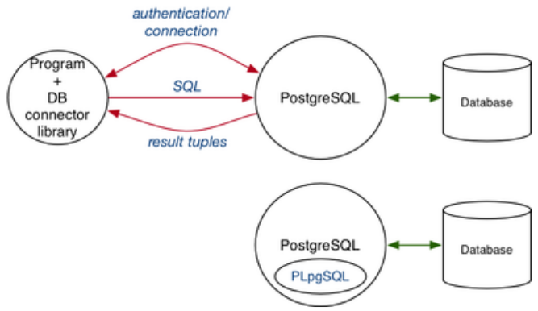
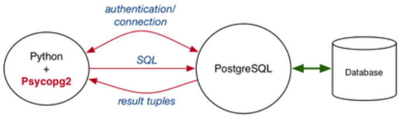

# Programming with Databases

So far we have seen:

* accessing data via SQL queires
* packaging SQL queries as views/functions
* building functions to return tables
* implementing assertions via triggers

All of the above programming is very close to the data and takes place inside the DBMS.

While SQL (and PLpgSQL) gives powerful data access mechanisms, it is **not** an application programming language.

Complete applications require code to

* handle the user interface (GUI or Web)
* interact with other systems (e.g. other databases)
* perform compute-intensive work (vs. data-intensive work)

"Conventional" programming languages (PLs) provide these and we need programming languagesand DBMS connectivity.

Requirements of an interface between programming langauges and RDBMS:

* mechanism for connecting to the DBMS (authentication)
* mechanism for mapping programming language "requests" to database queries
* mechanism for iterating over query results
* mapping between tuples and programming language objects

The distance between programming languages and DBMS is variable; e.g. `libpq` allows C programs to use PG struct and JDBC transmits SQL strings and retrieves tuples-as-objects.

Programming Language/DBMS architecture:



## PL/DB Interface

Common database access API used in programming languages:

``` txt
db = connect_to_dbms(DBname, User/Password);
query = build_SQL("SqlStatementTemplate", values);
results = execute_query(db,query);

while (more_tuples_in(results))
{
    tuple = fetch_row_from(results);
    // do something with values  in tuple
}
```

This pattern is used in many different libraries; Java/JDBC, PHP/PDO, Perl.DBI, Python/Psycopg2, Tcl etc.

Many database access libraries have similar overall structure. However they differ in details;

* whether specific to one database or generic
* whether object-oriented or procedural flavour
* function/method names and parameters
* how to get data from program into SQL statements
* how to get data from tuples into program variables

Object-relational mappers (ORMs) aim to hide the details of the database schema and queries. It allows programmers to manipulate objects, not tuples. They may potentially used the PLDB connection inefficiently

## PL/DB Mismatch

There is tension between programming languages and DBMSs; DSBMSs deal very efficiently with large sets of tuples while programming languages encourage dealing with single tuples/objects.

If not handled carefully, it can lead to inefficient use of the database.

Note: relative costs of database access operations;

* establishing a DBMS - very high
* initiating a SQL query - high
* accessing individual tuple - moderate

Consider this (imaginary) PL/DBMS access method:

``` sql
-- establish connection to DBMS
db = dbAccess("DB");
query = "select a,b from R,s where ...";
-- invoke query and get handle to result set
results = dbQuery(db, query);
-- for each tuple in result set
while (tuple = dbNext(results)) {
    -- process next tuple
    process(tuple['a'], tuple['a']);
}
```

Estimated costs: `dbAccess=500ms`, `dbQuery=200ms`, `dbNext=10ms`  
In later cost estimates, ignore `dbAccess`. It is the same base cost for all examples.

Example: find mature-age students

``` sql
query = "select * from Students";
results = dbQuery(db, query);
while (tuple = dbNext(results)) {
    if (tuple['age'] >= 40) {
        -- process mature-age student
    }
}
-- If we have 10000 students and only 500 of them are over 40,
-- we transfer 9500 unnecessary tuples from the database
-- cost = 1*200 + 10000*10 = 100200ms = 100ms

-- should be implemented as
query = "select * from Students where age >= 40";
results = dbQuery(db, query);
while (tuple = dbNext(results)) {
    -- process mature-age student
}
-- transfers only the 500 tuples that are needed
-- cost = 1*200 + 500*10 = 5200ms = 5s
```

Example: find infor about all marks for all students

``` sql
query1 = "select id,name from Student";
res1 = dbQuery(db, query1);
while (tuple1 = dbNext(res1)) {
    query2 = "select course,mark from Marks".
                " where student = {tuple1['id']}";
    res2 = dbQuery(db, query2);
    while (tuple2 = dbNext(res2)) {
        -- process student/course/mark info
    }
}
-- If we have 10000 students, each with 8 marks, we run 10001 queries on the database
-- cost = 10001*200 + 80000*10 = 2800s = 46min

-- should be implemented as
query = "select id,name,course,mark"
        + "from Student s, Marks m"
        + "where s.id=m.student";
results = dbQuery(db, query);
while (tuple = dbNext(results)) {
    -- process student/course/mark info
}
-- we invoke 1 query, and transfer the same number of tuples
-- cost = 1*200 + 80000*10 = 800s  =13 min
```

## Psycopg2

**Psycopg2** is a Python module that provides:

* a method to connect to PostgreSQL databases
* a collection of database-related exceptions
* a collection of type and object constructors

In order to use Psycopg2 in a python program `import psycopg2` (assuming the module is installed on your system)

Where `psycopg2` fits in the PL/DB architecture:



### Database `connection`s

`conn = psycopg2.connect(DB_connection_string)` creates a `connection` object on a named database effectively starting a session with the database (cf `psql`). It returns a `connection` object used to access the database. If it can't connect, it raises an exception.

Database connection string components:

* `dbname` - name of database
* `user` - user name (for authentication)
* `password` - user password (for authentication)
* `host` - where the server is running (default is localhost)
* `port` - which port is the server listening on (default=5432

On `grieg` only `dbname` is required.

Example: a simple script that connects and then closes connection

``` python
import psycopg2

try:
    conn = psycopg2.connect("dbname=mydb")
    print(conn)     # state of connection after opening
    conn.close()
    print(conn)     # state of connection after closing
except Exception as e:
    print("Unable to connect to database")
```

If `mydb` is accessible, the following output is produced:

``` s
$ python3 ex1.py
<connection object at 0xf67186ec; dsn: 'dbname=mydb', closed: 0>
<connection object at 0xf67186ec; dsn: 'dbname=mydb', closed: 1>
```

We can connect to a database using `sqlite3`. Here is a simple script that connects to a database and then closes the connection:

``` python
import sqlite3

try:
    conn = sqlite3.connect("mydb.bd")
    print(conn)     # state of connection after opening
    conn.close()
    print(conn)     # state of connection after closing
except Exception as e:
    print("Unable to connect to database")
```

#### Operations on `connection`s

* `cur = conn.cursor()` sets up a handle for performing queries/updates on a database. You must create a `cursor` before performing any database operations
* `conn.close()` closes the database connection `conn`
* `conn.commit()` commits changes made to the database since the last `commit()`

See [Psycopg2 documentation](https://www.psycopg.org/docs/) for more.

### Database `cursor`s

Cursors are "pipelines" to the database.  
Cursor objects allow you to execute queries, perform updates, change meta-data etc.

Cursors are created from a database `connection`. You can create multiple cursors from the same connection. Each cursor handles one database operation at a time, but they are not isolated (i.e. they can see each others' changes)

To set up a cursor called `cur` use `cur = conn.cursor()`

#### Operations on `cursor`s

* `cur.execute(SQL_statement, Values)` executes a query.  
If supplied, it inserts values into the SQL statement, then executes the SQL statement. Results are available via the cursor's fetch methods.
Example:

    ``` python
    # run a fixed query
    cur.execute("select * from R where x=1")

    # run a query with values inserted
    cur.execute("select * from R where x = ?", (1,))
    cur.execute("select * from R where x = ?", [1])

    # run a query stored in a variable
    query = "select * from tasks where priority=?"
    pri = 3
    cur.execute(query, (pri,))
    ```

* `list = cur.fetchall()` gets all answers for a query and stores it in a list of tuples.
Example:

    ``` python
    import sqlite 3

    con = sqlite3.connect('mydb.db')
    cur = con.cursor()
    cur.execute('SELECT name from sqlite_master where type="table"')
    print(cur.fetchall())
    con.close()
    ```

* `tup = cur.fetchone()` gets the next result for a query and stores it in a tuple.
Example:

    ``` python
    # table R contains (1,2), (2,1), ...
    cur.execute("select * from R")
    while True:
        t = cur.fetchone()
        if t == None:
            break
        x, y = t
        print(x,y)
    # prints
    # 1 2
    # 2 1
    # ...
    ```

* `tup = cur.fetchmany(nTuples)` gets the next `nTuples` results for a query at a time.  
It stores the tuples in a list. When there are no results, it returns an empty list
Example:

    ``` python
    # table R contains (1,2), (2,1), ...
    cur.execute("select * from R")
    while True:
        tups = cur.fetchmany(3)
        if tups == []:
            break
        for tup in tups:
            x,y = tup
            print(x,y)
    # prints
    # 1 2
    # 2 1
    # ...
    ```

* `cur.executemany(SQL_statement, Values)` executes a database operation against all parameter sequences  
It is handy for operations such as a bulk insert
Example:

    ``` python
    import sqlite3

    con = sqlite3.connect('mydb.db')
    cur = con.cursor()
    cur.execute('create table if not exists projects(id integer, name text)')
    data = [(1, "Ridesharing"), (2, "Water Purifying"), (3, "Forensics"), (4, "Botany")]
    cur.executemany("INSERT INTO projects VALUES(?, ?)", data)
    con.commit()
    ```

* `cur.mogrify(SQL_statement, Values)` returns the SQL statement as a string with values inserted.  
It is useful for checking whether `execute()` is doing what you want
Example:

    ``` python
    query = "select * from R where x = %s"
    print(cur.mogrify(query, [1])
    # Produces: b'select * from R where x = 1'

    query = "select * from R where x = %s and y = %s"
    print(cur.mogrify(query, [1,5]))
    # Produces: b'select * from R where x = 1 and y = 5'

    query = "select * from Students where name ilike %s"
    pattern = "%mith%"
    print(cur.mogrify(query, [pattern]))
    # Produces: b"select * from Students where name ilike '%mith%'"

    query = "select * from Students where family = %s"
    fname = "O'Reilly"
    print(cur.mogrify(query, [fname]))
    # Produces: b"select * from Students where family = 'O''Reilly'"
    ```
