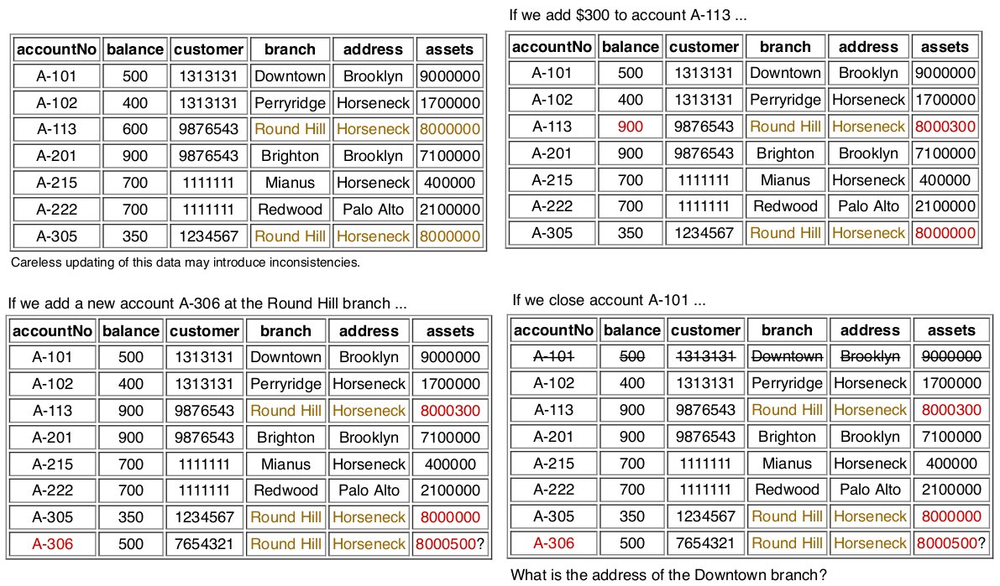

# Relational Design Theory

Functional dependencies describe relationships between attributes within a relation. They have implications for "good" relational schema design.

The aim is to improve understanding of relationships among data and gain enough formalism to assist practical database design.

A _good_ relational database design must capture **all** necessary attributes/associates and do this with **minimal** amount of stored information.  
Minimal stored information ⇒ no redundant data.

In database design **redundancy** is generally a "bad thing" since it causes problems maintaining consistency after updates. But, redundancy may give performance improvements; e.g. avoid a join to collect pieces of data together.

Consider the following relation defining bank accounts/branches.



We have the following issues in the relation above:

* **insertion anomaly** - when we insert a new record, we need to check that branch data is consistent with existing tuples
* **update anomaly** - if a branch changes address, we need to update all tuples referring to that branch
* **deletion anomaly** -  if we remove information about the last account at a branch, all of the branch information disappears

The insertion and update anomalies can be handled (e.g. by triggers) but this requires extra DBMS work on every change to the database.

To avoid these kinds of update problems, we need a schema with **minimal overlap** between tables and each table contains a **coherent** collection of data values. Such schemas have little to no redundancy.

ER to SQL mappings tend to give non-redundant schemas but does not guarantee no redundancy.

The methods we describe can reduce redundancy in schemas, hence eliminating insertion and update anomalies.

A possible way to _generate_ non-redundant schemas:

1. start with a **universal relation** U (containing all relevant attributes); this schema would have maximum redundancy  
e.g Banking(accountNo, balance, customer, branch, address, assets)
2. specify how attributes relate to each other
3. **decompose** relation U into several smaller relations Ri, where each Ri has **minimal overlap** with other Rj but sufficient overlap to reconstruct the original relation
4. repeat decomposition step until no further decomposition is possible.

Typically each Ri ends up containing info about one _entity_ (e.g. a customer)

## Notation/Terminology

Most texts adopt the following terminology:

``` txt
Attributes              upper-case letters from the start of the alphabet (e.g. A, B, C, ..)
Sets of attributes      concatenation of attibute names (e.g. X=ABCD, Y=EFG)
Relation schemas        upper-case letters, denoting a set of all attributes (e.g. R)'
Relation instances      lower-case letter corresponding to the schema (e.g. r(R))
Tuples                  lower-case letters (e.g. t, t', t1, u, v)
Attributes in tuples    tupler[attrSet] (e.g. t[ABCD], t[X])
```

## Functional Dependency

A relation instance r(R) satisfies a dependency X → Y if  
for any t, u ∈ r, t[X] = u[X] ⇒ t[Y] = u[Y]

In other words, if two tuples in R agree in their values for the set of attributes X, then they must also agree in their values for the set of attributes Y.  
We say "_Y is functionally dependent on X_"

Attribute sets X and Y may overlap; and trivially it is true that X → X.

Notes:

* X → Y can also be read a s"_X determines Y_"
* the single arrow → denotes **functional dependency** (_fd_)
* the double arrow ⇒ denotes logical implication

Consider the following (redundancy-laden) schema:

``` txt
Title         | Year | Len | Studio    | Star
--------------+------+-----+-----------+---------------
King Kong     | 1933 | 100 | RKO       | Fay Wray
King Kong     | 1976 | 134 | Paramount | Jessica Lange
King Kong     | 1976 | 134 | Paramount | Jeff Bridges
Mighty Ducks  | 1991 | 104 | Disney    | Emilio Estevez
Wayne's World | 1995 | 95  | Paramount | Dana Carvey
Wayne's World | 1995 | 95  | Paramount | Mike Meyers
```

One functional dependencies:  
`Title Year → Len`, `Title Year → Studio`  
Not a functional dependency:  
`Title Year ↛ Star`

Consider an instance r(R) of the relation schema R(ABCDE):

| A   | B   | C   | D   | E   |
| --- | --- | --- | --- | --- |
| a1  | b1  | c1  | d1  | e1  |
| a2  | b1  | c2  | d2  | e1  |
| a3  | b2  | c1  | d1  | e1  |
| a4  | b2  | c2  | d2  | e1  |
| a5  | b3  | c3  | d1  | e1  |

Since A values are unique, the definitions of functional dependency gives:  
`A → B`, `A → C`, `A → D`, `A → E`, or `A → BCDE`  
Since all E values are the same, it follows that:  
`A → E`, `B → E`, `C → E`, `D → E`

Other observations:

* combinations of BC are unique, therefore BC → ADE
* combinations of BD are unique, therefore BD → ACE
* if C values match, so do D values, therefore C → D
* however D values do not determine C values so !(D → C)

We could derive many other dependencies; e.g. AE → BC

In practice, we choose the minimal set of _fd_ s (basis) from which all other _fd_ s can be derived, which captures useful problem-domain information.

More important for design is dependency across all possible instances of the relation (i.e schema-based dependency).  
This is a simple generalisation of the previous definition  
for any t, u ∈ **any** r, t[X] = u[X] ⇒ t[Y] = u[Y]  
such dependencies capture semantics of the problem domain.

Generalising some ideas about functional dependency:

* are there dependencies that hold for _any_ relation?  
Yes, but they are generally trivial; e.g. Y ⊂ X ⇒ X → Y
* do some dependencies suggest the existence of others?  
Yes, **rules of inference** allow us to _derive_ dependencies. They allow us to reason about sets of functional dependencies

### Inference Rules

_Armstrong's rules_ are general rules of inference on functional dependencies

**F1. Reflexivity** e.g. X → X; a formal statement of trivial dependencies; useful for derivations  
**F2. Augmentation** e.g. X → Y ⇒ XZ → XY; if a dependency holds then we can expand its left hand side (along with the right hand side)  
**F3. Transivity** e.g. X → Y, Y → Z ⇒ X → Z; the "most powerful" inference rule; useful in multi-step derivations

Armstrong's rules are complete, but other useful rules exist:  
**F4. Additivity** e,g, X → Y, X → Z ⇒ X → YZ; useful for constructing new right hand sides of functional dependencies (also called **_union_**)  
**F5. Projectivity** e.g X → YZ ⇒ X → Y, X → Z; useful for reducing right hand sides of functional dependencies (also called **_decomposition_**  
**F6. Pseudotransitivity** e.g. X → Y, YZ → W ⇒ XZ → W; shorthand for common transitivity derivation  

Example: determining validity of AB → GH, given:  

``` txt
R = ABCDEFGHIJ
F = { AB → E, AG → J, BE → I, E → G, GI → H }
Derivation:
AB → E  (given)
E  → G  (given)
AB → G  (using F3 on 1,2)
AB → AB (using F1)
AB → B  (using F5 on 4)
AB → BE (using F4 on 1,5)
BE → I  (given)
AB → I  (using F3 on 6,7)
AB → GI (using F4 on 3,8)
GI → H  (given)
AB → H  (using F3 on 9,10)
AB → GH (using F4 on 3,11)
```

### Closures

For a finite set of attributes, there must be a finite set of derivable functional dependencies.

The largest collection of dependencies that can be derived from F is called the **closure of F** and is denoted F+ (F^+).

Closures allow us to answer two interesting questions:

* Is a particular dependency X → Y derivable from F?  
Compute the closure F+ and check whether X → Y ∈ F +
* Are two sets of dependencies F and G equivalent?  
Compute closures F+ and G+ and check whether they are equal

Unfortunately closres can be very large e.g.  
R = ABC, F = { AB → C, C → B }  
F+ = { A → A, AB → A, AC → A, AB → B, BC → B, ABC → B, C → C, AC → C, BC → C, ABC → C, AB → AB, . . . . . . , AB → ABC, AB → ABC, C → B, C → BC, AC → B, AC → AB }

Algorithms based on F+ rapidly become infeasible.  
To solve this problem, use closures based on **sets of attributes** rather than sets of functional dependencies.

Given a set X of attributes and a set F of functional dependencies, the **closure of X** (denotes X+ (X^+)) is the largest set of attributes that can be derived from X using F.

We can prove (using additivity) that (X → Y) ∈ F+ iff Y ⊂ X+

For computation, |X+| is bounded by the number of attributes

So, for the questions we asked earlier:

* For the question "is X → Y derivable from F?"  
Compute the closure X+ , check whether Y ⊂ X+
* For the question "are F and G equivalent?"  
For each dependency in G, check whether it is derivable from F
For each dependency in F, check whether it is derivable from G
If it is true for all, then F ⇒ G and G ⇒ F which implies F+ = G+
* For the question "what are the keys of R implied by F?  
Find subsets K ⊂ R such that K+ = R
_a key is a set of attributes that can uniquely determine the values of R_

## Normalisation

**Normalisations** is a branch of relational theory providing design insights

The goal of normalisation is:

* be able to characterise the **level of redundancy** in a relational schema
* provide mechanisms for transforming schemas to remove redundancy

Normalisation draws heavily on the theory of functional dependencies

### Normal Forms

Normalisation theory defines _six normal forms_ (NFs):

* First, Second, Third Normal Forms (1NF, 2NF, 3NF) (Codd 1972)
* Boyce-Codd Normal Form (BCNF) (1974)
* Fourth Normal Form (4NF) (Zaniolo 1976, Fagin 1977)
* Fifth Normal Form (5NF) (Fagin 1979)

NF hierarchy: 5NF ⇒ 4NF ⇒ BCNF ⇒ 3NF ⇒ 2NF ⇒ 1NF

We say that a "schema is in xNF" which tells us something about the level of redundancy in the schema  
1NF allows the most redundancy; 5NF allows least redundancy.  
For most practical purposes, BCNF (or 3NF) are acceptable NFs

* **1NF** - all attributes have atomic values; we assume this as part of relational model, so every relation schema is in 1NF
* **2NF** - all non-key attributes full depend on key (i.e. no partial dependencies); avoids much redundancy
* **3NF/BCNF** - no attributes dependent on non-key attributes (i.e. no transitive dependences); avoid most remaining redundancy

Normalisations aim to put a schema into xNF by ensuring that all relations in the schema are in xNF.

How normalisation works:

1. decide which normal form xNF is "acceptable" (i.e. how much redundancy are we willing to tolerate)
2. check whether each relation in the schema is in xNF
3. if a relation is not in xNF, _partition_ inot sub-relations where each is "closer to " xNF
4. repeat until all relations in the schema are in xNF

In practice, BCNF and 3NF are the most important.

Boyce-Codd Normal Form (BCNF) eliminates all redundancy due to functional dependencies, but may not preserve original functional dependencies  
Third Normal Form (3NF) eliminates most (but not all) redundancy due to functional dependencies and is guaranteed to preserve all functional dependencies

### Relation Decomposition

The standard transformation technique to remove redundancy is to **decompose** relation R into relations S and T.

We accomplish decomposition by selecting (overlapping) subsets of attributes forming new relations based on attribute subsets.

Properties R = S ∪ T, S ∩ T ≠ ∅ and r(R) = s(S) ⋈ t(T)

It may require several decompositions to achieve acceptable NF  
Normalisation algorithms tell us how to choose S and T

### Schema (Re)Design

Consider the following relation for BankLoans

``` txt
branchName | branchCity  | assets  | custName  | loanNo | amount
-----------+-------------+---------+-----------+--------+-------
Downtown   | Brooklyn    | 9000000 | Jones     | L-17   | 1000
Redwood    | Palo Alto   | 2100000 | Smith     | L-23   | 2000
Perryridge | Horseneck   | 1700000 | Hayes     | L-15   | 1500
Downtown   | Brooklyn    | 9000000 | Jackson   | L-15   | 1500
Mianus     | Horseneck   | 400000  | Jones     | L-93   | 500
Round Hill | Horseneck   | 8000000 | Turner    | L-11   | 900
North Town | Rye         | 3700000 | Hayes     | L-16   | 1300
```

This schema has all of the update anomalies mentioned earlier.

To improve the design, decompose the BankLoans relation.

The following decomposition is not helpful because we lose information (such as which branch is a loan held at)

``` txt
Branch(branchName, branchCity, assets)
CustLoan(custName, loanNo, amount)
```

Another possible decomposition is:

``` txt
Branch(branchName, branchCity, assets, custName)
CustLoan(custName, loanNo, amount)
```

``` txt
The BranchCust relation instance
branchName | branchCity  | assets  | custName
-----------+-------------+---------+---------
Downtown   | Brooklyn    | 9000000 | Jones
Redwood    | Palo Alto   | 2100000 | Smith
Perryridge | Horseneck   | 1700000 | Hayes
Downtown   | Brooklyn    | 9000000 | Jackson
Mianus     | Horseneck   | 400000  | Jones
Round Hill | Horseneck   | 8000000 | Turner
North Town | Rye         | 3700000 | Hayes

The CustLoan relation instance:
 custName  | loanNo | amount
-----------+--------+-------
 Jones     | L-17   | 1000
 Smith     | L-23   | 2000
 Hayes     | L-15   | 1500
 Jackson   | L-15   | 1500
 Jones     | L-93   | 500
 Turner    | L-11   | 900
 Hayes     | L-16   | 1300
```

Now consider the result of `BranchCust join CustLoan`

``` txt
branchName | branchCity  | assets  | custName  | loanNo | amount
-----------+-------------+---------+-----------+--------+-------
Downtown   | Brooklyn    | 9000000 | Jones     | L-17   | 1000
Downtown   | Brooklyn    | 9000000 | Jones     | L-93   | 500
Redwood    | Palo Alto   | 2100000 | Smith     | L-23   | 2000
Perryridge | Horseneck   | 1700000 | Hayes     | L-15   | 1300
Perryridge | Horseneck   | 1700000 | Hayes     | L-16   | 1500
Downtown   | Brooklyn    | 9000000 | Jackson   | L-15   | 1500
Mianus     | Horseneck   | 400000  | Jones     | L-93   | 500
Mianus     | Horseneck   | 400000  | Jones     | L-17   | 100
Round Hill | Horseneck   | 8000000 | Turner    | L-11   | 900
North Town | Rye         | 3700000 | Hayes     | L-16   | 1300
North Town | Rye         | 3700000 | Hayes     | L-17   | 1500
```

This is clearly not a successful decomposition. The fact that we ended up with extra tuples was symptomatic of losing some critical "connection" information during the decomposition.  
Such a decomposition is called **lossy decomposition**

In a good decomposition, we should be able to reconstruct the original relation exactly: _if R is decomposed into S and T,, then Join(S,T)=R_  
Such a decomposition is called **lossless join decomposition**

### Boyce-Codd Normal Form

A relation schema R is in BCNF w.r.t a set F of functional dependencies iff:  
For all functional dependencies X → Y in F+:

* either X → Y is trivial (i.e. Y ⊂ X)
* or X is a superkey (i.e. non-strict superset of attributes in key/ X contains the key)

A database schema is in BCNF if all of its relation schemas are in BCNF.

Observations:

* any two-attribute relation is in BCNF
* any relation with key K, other attributes Y and K → Y is in BCNF

If we transform a schema into BCNF, we are **guaranteed**:

* no update anomalies due to functional dependency-based redundancy
* lossless join decomposition

However we are **not guaranteed** the new schema preserves all functional dependencies from the original schema.  
This may be a problem if the functional dependencies contain significant semantic information about the problem domain. If we need to preserve dependencies, use 3NF.

A dependency X → Y is not preserved if, for example, X =ABC and ABC are in relation R, after decomposition into S and T, AB is in S and BC is in T

#### BCNF Decomposition

The following algorithm converts an arbitrary schema into BCNF:

``` txt
Inputs: schema R, set F of fds
Output: set Res of BCNF schemas

Res = {R};
while (any schema S ∈ Res is not in BCNF) {
    choose any fd X → Y on S that violates BCNF
    Res = (Res-S) ∪ (S-Y) ∪ XY
}

English equivalent:
for schemas S that doesn't satisfy BCNF
    choose a fd X → Y
    create two new schemas; S-Y, XY
```

The last step means: make a table from XY; drop Y from table S  
The "choose any" step means that the algorithm is non-deterministic

Example: the BankLoans schema  
`BankLoans(branchNAme, branchCity, assets, custName, loanNo, amount)`  
has functional dependencies F:

* `branchName → assets, branchCity`
* `loanNo → amount, branchName`

The key for `BankLoans` is `branchNAme, custName, loanNo`

Applying the BCNF algorithm:

* check `BankLoans` relation - it is not in BCNF  
(`branchName → assets,branchCity` violates BCNF criteria; LHS is not a key)
* to fix - decompose `BankLoans` into  
`Branch(branchName, branchCity, assets)`
`LoanInfo(branchName, custName, loanNo, amount)`
* check `Branch` relation - it is in BCNF (the only nontrivial fd has LHS=branchName, which is a key)
* check `LoanInfo` relation - it is not in BCNF  
(`loanNo → amount,branchName `violates BCNF criteria; LHS is not a key)
* to fix - decompose `LoanInfo` into  
`Loan(branchName, loanNo, amount)`
`Borrower(custName, loanNo)`
* check Loan - it is in BCNF
* check Borrower - it is in BCNF

Overall schemas:

``` txt
Branch(branchName, branchCity, assets)
Loan(branchName, loanNo, amount)
Borrower(custName, loanNo)
```

Notes:
For `Branch`: key = `branchname`, FDs are `branchName → assets,branchCity`
For `LoanInfo`: key = `loanNo,custName`, FDs are `loanNo → amount,branchName`

### Third Normal Form

A relation schema R is in 3NF w.r.t a set of F of functional dependencies iff:  
For all functional dependencies X → Y in F+:

* either X → Y is trivial (i.e. Y ⊂ X)
* or X is a superkey (i.e. non-strict superset of attributes in key/ X contains the key)
* or Y is single attribute from a candidate key

A database schema is in 3NF if all relation schemas are in 3NF

If we transform a schema into 3NF, we are **guaranteed**:

* lossless join decomposition
* the new schema preserves all of the functional dependencies from the original schema

However, we are **not guaranteed** that no update anomalies are due to functional dependency-based redundancy

Whether to use BCNF or 3NF depends on overall design considerations

### 3NF Decomposition

The following algorithm converts an arbitrary schema to 3NF:

``` txt
Inputs: schema R, set F of fds
Output: set R i of 3NF schemas

let Fc be a minimal cover for F
Res = {}
for each fd X → Y in Fc {
    if (no schema S ∈ Res contains XY) {
        Res = Res ∪ XY
    }
}
if (no schema S ∈ Res contains a candidate key for R) {
    K = any candidate key for R
    Res = Res ∪ K
}

English equivalent:
create a schema for each fd
if the key does not exist in any of the schema, make it a schema
```

The critical step is producing minimal cover Fc for F

A set F of fds is minimal if
* every fd X → Y is simple  
(Y is a single attribute)
* every fd X → Y is left-reduced  
(no Z ⊂ X such that Z → A could replace X → A in F and preserve F + )
* every fd X → Y is necessary  
(no X → Y can be removed without changing F + )

Algorithm: right-reduce, left-reduce, eliminate redundant fds

Example: consider the schema R and set of functional dependencies F  
`R = ABCDEFGH`  
`F = Fc = { ABH → C, A → D, C → E, F → A, E → F, BGH → E }`

The key is `BGH` (or `BF` or ...)

The schema will be decomposed into relations containing:

``` txt
ABHC
AD
CE
AF
EF
BEGH
```

At least one of these includes the key (`BGH`)  
If they key was `BF`, then we'd need to make an extra table `BF`

## Database Design Methodology

To achieve a "good" database design:

* identify attributes, entities, relationships (ER design)
* map ER design to relational schema
* identify constraints (including keys and functional dependencies)
* apply BCNF/3NF algorithms to produce normalised schema

Note: may subsequently need to "denormalise" if the design yields inadequate performance
