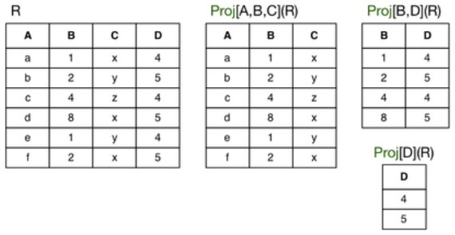

# Relational Algebra

**Relational algebra (RA)** can be viewed as a mathematical system for manipulating relations, or data manipulation language (DML) for the relational model.

Relational algebra consists of:

* **operands** - relations, or variables representing relations
* **operators** that map relations to relations
* rules for combining operands/operators into expressions
* rules for evaluating such expressions

Why is it important?  
It forms the basis for DBMS implementation. Relational algebra operations are like the machine code for DBMS.

Core relational algebra operations:

* **selection**: choosing a subset of tuples/rows
* **projections**: choosing a subset of attributes/columns
* **product**, **join**: combining relations
* **union**, **intersection**, **difference**: combining relations
* **rename**: change names of relations/attributes

Common extension include: _aggregations_, _projection++_, _division_

Select, project, join provide a powerful set of operations for building relations and extracting interesting data from them.


Adding set operations and renaming make relational algebra _complete_

## Notation

Standard treatments of relational algebra use Greek symbols.  
We will use the following notation (because it is easier to reproduce)


For other operations (e.g. set operations) we adopt the standard notation  
Except when typing in a text file, where `*`=intersection and `+`=union

## Describing RA Operations

We define the semantics of RA operations using:

* "conditional set" expressions; e.g. `{X | condition on X}`
* tuple notations:
    * t[AB] \(extracts attributes A and B from tuple t\)
    * [x,y,z] \(enumerated tupes; specify attribute values\)
* quantifiers, set operations, boolean operators

For each operations, we also describe it operationally (i.e. give an algorithm to compute the result, tuple-by-tuple)

All RA operators return a result of type _relation_. For convenience, we can name a result and use it later. E.g

``` sql
Temp = R op1 S op2 T
Res = Temp op3 X
-- which is equivalent to
Res = (R op1 S op2 T) op3 X
```

Each "intermediate result" has a well-defined schema.

When explaining RA operations, we will use the following relations as examples:


## Rename

**_Rename_** provide "schema mapping"

If expression E returns a relation R(A1,A2,...,An) then `Rename[S(B1,B2,...Bn)](E)` give a relation called S containing the same set of tuples as E, but with the name of each attribute change from Ai to Bi

Rename is like the identity function on the contents of a relation.

The only thing that Rename change is the schema.

Rename can sometime be viewed as a "technical" apparatus of RA.

Sometimes we use implicit rename/project in sequences of RA operations e.g.

``` sql
--- R(a,b,c), S(c,d)
Res = Rename[Res(b,c,d)]((Project[b,c](Sel[a>5](R))) Join S)
-- vs
Tmp1 = Select[a>5](R)
Tmp2 = Project[b,c](Tmp1)
Tmp3 = Rename[Tmp3(cc,d)](S)
Tmp4 = Tmp2 Join[c=cc] Tmp3
Res = Rename[Res(b,c,d)](Tmp4)
-- vs
Tmp1(b,c) = Select[a>5](R)
Tmp2(cc,d) = S
Res(b,c,d) = Tmp1 Join[c=cc] Tmp2
```

In SQL, we achieve a similar effect by defining a set of views

## Selection

**_Selection_** returns a subset of the tuples in a relation r(R) that satisfy a specified condition C

`Sel[C](r) = {t | t ∈ r ∧ C(t)}`, where C is a boolean expression on attributes in R  
Result size: `|Sel[C](r)| ≤ |r|`  
Result schema: same as the schema of r (i.e. R)  
Algorithmic view:

``` sql
result = {}
for each tulpe t in relation r
    if (C(t)) {result = result + {t}}
```

Examples of selection:


Querying with relational algebra (selection):

``` sql
-- Details of all bars in The Rocks
Result = Sel[addr=The Rocks]{Bars}

-- Beers made by Sierra Nevada
SNBeers = Sel{manf=Sierra Nevada}(Beers)
Result = Rename[beer](Proj[name](SNBeers))
```

## Projection

**_Projection_** returns a set of tuples containing a subset of the attributes in the original relation.

`Proj[X](r) = {t[X] | t ∈ R}`, where r(R) and X specifies a subset of the attributes of R

Note that removing key attributes can produce duplicates.  
In RA, duplicates are **removed** from the result set, but in RDMBS, duplicates are **retained** (i.e. they use _bags_ not sets)

Result size: `|Proj[X](r) ≤ |r|`  
Result schema: R'(X)  
Algorithmic view:

``` sql
result = {}
for each tuple t in relation r
    result = result + {t[X]}
```

Examples of projection:



Querying with relational algebra (projection):

``` sql
-- Name of all bars
Result = Proj[name](Beers)

-- Name of drinkers who live in Newtown
Result = Proj[name](Sel[addr=Newtown](Drinkers))

-- All the breweries
Result(brewer) = Project[manf](Beers)
```

## Union and Intersection

**_Union_** combine two **compatible** relations into a single relation via set union of sets of tuples

`r1 ∪ r2 = {t | t ∈ r1 ∨ t ∈ r2}`, where r1(R),r2(R)

Result size: `|r1 ∪ r2 | ≤ |r1| + |r2|`  
Result schema: R  
Algorithmic view:

``` sql
result = r1
for each tuple t in relation r2
    result = result + {t}
```

**_Intersection_** combines two **compatible** relations into a single relation via set intersection of sets of tuples. It uses the same notion of relation compatibility as union.

`r1 ∩ r2 = {t | t ∈ r1 ∧ t ∈ r2}`, where r1(R), r2(R)

Result size: `|r1 ∩ r2 | ≤ min(|r1|, |r2|)`  
Result schema: R  
Algorithmic view:

``` sql
result = {}
for each tuple t in relation r1
    if (t ∈ r2 ) { result = result + {t} }
```

Example of union and intersection:


Querying with relational algebra (set operations):

``` sql
-- Bars where John or Gernot drinks
JohnBars = Proj[bar](Sel[drinker=John](Frequents))
GernotBars = Proj[bar](Sel[drinker=Gernot](Frequents))

Result = JohnBars union GernotBars

-- Bars where John and Gernot drink
Result = JohnBars interset GernotBars
```

## Difference

**_Difference_** finds the set of tuples that exist in one relation but do not occur in a second **comptible** relation. It uses the same notion of relation compatibility as union.

`r1 - r2 = {t | t ∈ r1 ∧ ¬ t ∈ r2}`, where r1(R), r2(R)

Note: tuples in r2, but not in r1 do not appear in the result (i.e. set difference does not equal the complement of set intersection)

Algorithmic view:

``` sql
result = {}
for each tuple t in relation r1
    if (!(t ∈ r2)) {result = result + {t}}
```

Example of difference:


You can see the result of the differences are **not symmmetric**

Querying with relational algebra (difference):

``` sql
-- Bars where John drinks and Gernot doesn't
JohnBars = Proj[bar](Sel[drinker=John](Frequents))
GernotBars = Proj[bar](Sel[drinker=Gernot](Frequents))
Result = JohnBars - GernotBars

-- Bars that sell VB but not New
VBBars = Proj[bar](Sel[beer=VB](Sells))
NewBars = Proj[bar](Sel[beer=New](Sells))
Result = VBBars - NewBars
```

## Product

**_Product_** (Cartesian product) combines information from two relations **pairwise** on tuples. Note: relations do not have to be union-compatible

`r × s = {(t1 : t2 ) | t1 ∈ r ∧ t2 ∈ s }`, where r(R), s(S)

Each tuple in the result contains all attribute from r and s, possible with some fields renames to avoid ambiguity.  
If `t1 = (A1...An )` and `t2 = (B1 ...Bn)` then `(t1:t2) = (A1...An,B1...Bn)`

Result size: `|r × s| = |r|.|s|`  
Result Schema: `R ∪ S`  
Algorithmic view:

``` sql
result = {}
    for each tuple t1 in relation r
        for each tuple t2 in relation s
            result = result + {(t1:t2)}
```

Example of product:


## Joins

**_Natural join_** is a specialised product containing only pairs that match on **common** attributes with one of each pair of common attributes eliminated

Consider relation schema R(ABC..JKLM), S(KLMN..XYZ).  
The natural join of relations r(R) and s(S) is defined as:  
`r ⋈ s = r Join s = {(t1[ABC..J] : t2[K..XYZ]) | t1 ∈ r ∧ t2 ∈ s ∧ match }`,  
where `match = t1[K] = t2[K] ∧ t1[L] = t2[L] ∧ t1[M] = t2[M]`

Algorithmic view:

``` sql
result = {}
for each tuple t1 in relation r
    for each tuple t2 in relation s
        if (matches(t1,t2))
            result = result + {combine(t1,t2)}
```

Example of natural join


**_Theta join_** is a specialised product containing only pairs that match on a supplied condition C

`r ⋈C s = {(t1:t2 ) | t1 ∈ r ∧ t2 ∈ s ∧ C(t1:t2 )}`, where r(R),s(S)

All attribute names are required to be **distinct**

Can be defined in terms of other RA operations: `r ⋈ C s = r Join[C] s = Sel[C](r × s)`

Example of theta join:


(Theta join is the most frequently used join in SQL queries)

Querying with relational algebra (join):

``` sql
-- Who drinks in Newtown bars?
NewtownBars(nbar) = Sel[addr=Newtown](Bars)
Tmp = Frequents Join[bar=nbar] NewtownBars
Result(drinker) = Proj[drinker](Tmp)

-- Who drinks beers made by Carlton?
CarltonBeers = Sel[manf=Carlton](Beers)
Tmp = Likes Join[beer=name] CarltonBeers
Result(drinker) = Proj[drinker)Tmp
```

## Division

Consider two relation schemas R and S where S ⊂ R

The **_division_** operation is defined on instances r(R) and s(S) as

`r / s = r Div s = {t | t ∈ r[R-S] ∧ satisfy}`,  
where `satisfy = ∀ ts ∈ S (∃ tr ∈ R (tr[S] = ts ∧ tr [R-S] = t))`

Operationally:

* consider each subset of tuples in R that match on t[R-S]
* for this subset of tuples, take the t[S] values from each
* if this covers all tuples in S, then include t[R-S] in the result

Example of division:


Querying with relational algebra (division):

Division handles queries that include the notion "for all"; e.g. Which beers are sold in all bars?

We can answer this as follows:

1. generate a relation of beers and bars, where they are sold;  
`r1 = Proj[beer,bar](Sold)`
2. generate a relation of all bars;  
`r2 = Rename[r2(bar)](Proj[name](Bars))`
3. find which bars appear in tuples in every bar;  
`res = r1 Div r2`
