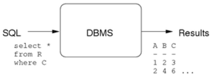
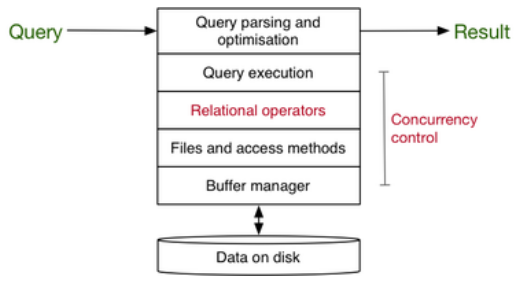
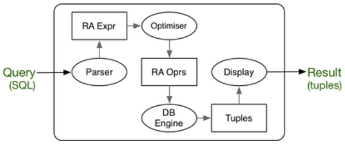
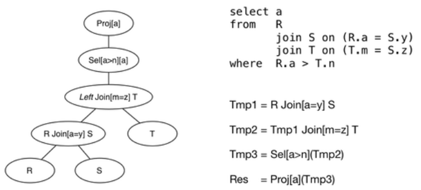

# DBMS Architecture

Knowing about DBMS architecture can help avoid/fix inefficiencies in database applications and ensure there are no concurrency issues.

DBMSs attempt to handle these issues in:

* **query processing (QP)** - methods for evaluating queries
* **transaction processing (TxP)** - controlling concurrency

As a programmer you give up a lot of control to the DBMS, but you can use

* QP knowledge to make DB applications **_efficient_**
* TxP knowledge to make DB applications **_safe_**

So far we have viewed a DBMS as a machine that processes SQL queries



One view of a database engine is a **_relational algebra virtual machine_** for operation; selection, projection, join, union, intersection, difference, sort, insert, delete.  
For each of these operations various data structures and algorithms are available. The DBMS may provide only one, or provide a choice.

Layers in a database engine (Ramakrishnan's View)



## Query Evaluation

The path of a query through its evaluation:



1. SQL is mapped to relational algebra
2. relational algebra expressions are optimised
3. database engine executes expressions to produce result

### Mapping SQL to relational algebra

``` sql
-- schema: R(a,b) S(c,d)
select a as x
from R join S on (b=c)
where d = 100;
-- could be mapped to
Tmp1(a,b,c,d) = R Join[b=c] S
Tmp2(a,b,c,d) = Sel[d=100](Tmp1)
Tmp3(a,b,c,d) = Proj[a](Tmp2)
Res(x) = Rename[Res(x)](Tmp3)
```

In general:

* `SELECT` clause becomes _projection_
* `WHERE` condition becomes _select_ or _join_
* `FROM` clause becomes _join_

A better approach of the translate query above would be

``` sql
Tmp1(a,b,c,d) = Sel[d=100](S)
Tmp2(a,b,c,d) = R Join[b=c] Tmp2
Tmp3(a,b,c,d) = Proj[a](Tmp2)
Res(x) = Rename[Res(x)](Tmp3)
```

Re-ordering the first two expressions helps filter out the amount of tuples processed; hence decreasing processing time.

The query: "Courses with more than 100 students in them?"

``` sql
-- Can be expressed in SQL as
select s.id, s.code
from Course c, Subject s, Enrolment e
where c.id = e.course and c.subject = s.id
group by s.id, s.code
having count(*) > 100;
-- and might be compiled to
Result = Project [id,code] (
    GroupSelect [size>100] (
        GroupBy [id,code] (
            Subject Join [s.id=c.subject] (Course Join[c.id=e.course] Enrolment)
        )
    )
)
-- this can be broken down into individual RA statements
Tmp1(sid,stu)= Course Join[c.id=e.course] Enrolment
Tmp2(sid,code,stu) = Subject Join[s.id=c.subject] Tmp1
Tmp3(sid,code,nstu) = GroupBy[id,code](Tmp2)
Result(sid,code) = Sel[nstu>100](Tmp3)
```

### Query Cost Estimation

The cost of evaluating a query is determined by

* the operations specified in the query execution plan
* size of relations (database relations and temporary relations)
* access mechanisms (indexing, hashing, sorting, join algorithms)
* size/number of main memory buffers (and replacement strategy)

Analysis of costs involves **estimating** the size of intermediate results and then, based on this, the cost of secondary storage accesses

Accessing data from the disk (I/O) the dominant cost in query evaluations

An **execution plan** is a sequence of relational operations.  
Consider the execution plan for σc (R ⋈ d S ⋈ e T)

``` sql
tmp1   := hash_join[d](R,S)
tmp2   := sort_merge_join[e](tmp1,T)
result := binary_search[c](tmp2)
-- or
tmp1   := sort_merge_join[e](S,T)
tmp2   := hash_join[d](R,tmp1)
result := linear_search[c](tmp2)
-- or
tmp1   := btree_search[c](R)
tmp2   := hash_join[d](tmp1,S)
result := sort_merge_join[e](tmp2)
```

All produce the same result, but have different costs

### Implementation of RA Operations

**Sorting** (quicksort, etc. are not applicable)

* external merge sort (cost O(Nlog B N) with B memory buffers)

**Selection** (different techniques developed for different query types)

* sequential scan (worst case, cost O(N))
* index-based (e.g. B-trees, cost O(logN), tree nodes are pages)
* hash-based (O(1) best case, only works for equality tests)

**Join** (fast joins are critical to success of relational DBMSs)

* nested-loop join (cost O(N.M), buffering can reduce to O(N+M))
* sort-merge join (cost O(NlogN+MlogM))
* hash-join (best case cost O(N+M.N/B), with B memory buffers)

### Query Optimisation

The "best" method for evaluating a query is making it have the **lowest cost** (i.e fast evaluation time)

**Cost** is measured in terms of pages read/written

* data is stored in fixed-size blocks (e.g. 4KB)
* data is transferred between disk and memory in whole blocks
* the cost of disk-memory transfer is the highest cost in the system
* processing in memory is very fast compared to I/O

A DBMS **query optimiser** works as follows:

``` sql
Input: relational algebra expression
Output: execution plan (sequence of RA ops)

bestCost = INF; bestPlan = none;
while (more possible plans) {
    plan = produce a new evaluation plan
    cost = estimated_cost(plan)
    if (cost < bestCost) {
        bestCost = cost; bestPlan = plan;
    }
}
return bestPlan
```

Typically, there are **very** many possible plans. Smarter optimisers generate a likely subset of possible plans

## Database Application Performance

In order to make database applications efficient, it is useful to know:

* what operations on the data does the application requires (which queries, updates, inserts and how frequently is each one performed)
* how these operations might be implemented in the DBMS (data structures and algorithms for select, project, join, sort, etc.)
* how much each implementation will cost (in terms of the amount of data transferred between memory and disk)

and then, "encourage" DBMS to use the most efficient methods.

We can achieve this by using indexes and avoiding certain SQL query structures

Application programmer choices that affect query cost:

* how queries are expressed
    * generally `join` is faster than sub-query, especially if the sub-query is correlated
    * filter first, then `join` (avoid large intermediate tables)
    * avoid applying functions in `where`/`group by` clauses
* creating _indexes_ on tables
    * index will speed-up filtering based on indexed attribtues
    * indexes are generally only effective on `=`, `<`, `>`
    * mainly useful if filtering occurs  much more frequent than updates

Whatever you do as a database application programmer, the DBMS will transform your query and attempt to make it execute as efficiently as possible.  
The transformation is carried out by the **query optimiser**, which assesses possible query execution approaches and evaluates the likely cost of each approach. It chooses the approach with the cheapest cost.  
You have no control over the optimisation process, but the choices you make can block certain options limiting the query optimiser's chance to improve

Example: query to find sales people earning more than $50K

``` sql
select name
from Employees
where salary > 50000 and empid in (select empid from WorksIn where dept='Sales');
-- a query evaluator might use the strategy
SalesEmp = (select empid from WorksIn where dept='Sales')
for each e in Employees {
    if (e.empid in SalesEmps && e.salary > 50000)
        add e to result set
}
```

This is not a good expression of the query since it needs to evaluate **all** employees, even if they are not in the Sales departments.

A different expression of the same query:

``` sql
select name
from Employees e
join WorksIn w using (empid)
where e.salary > 50000 and w.dept='Sales';
-- a query evaluator might use the strategy
SalesEmps = (select * from WorksIn where dept='Sales')
foreach e in (Employee join SalesEmps) {
    if (e.salary > 50000)
        add e to result set
}
```

This is a good expression of the query as it only examines Sales employees and uses a simpler test

A very poor expression of the query (correlated subquery)

``` sql
select name
from Employees e
where salary > 50000  and 'Sales' in (select dept from WorksIn where empid=e.id);
-- a query evaluator might use the strategy
for each e in Employees {
    Depts = (select dept from WorksIn where empid=e.id)
    if ('Sales' in Depts && e.salary > 50000)
        add e to result set
}
```

This needs to run a query for **every** employee

What is the difference in costs of the following queries:

``` sql
-- All timings were run on Grieg after buffers filled
-- Note that count(*) was used to reduce the amount of output,
-- while requiring the query to completely evaluate

select count(*) from titles where main_title like 'D%';
-- Average time 24ms
select count(*) from titles where substring(main_title,1,1) = 'D';
-- Average time 47ms
select count(*) from titles where main_title ~ '^D.*';
-- Average time 65ms

-- All of the above queries are evaluated very fast
-- LIKE is fast enough
-- Calling functions in a WHERE clause is relatively expensive
-- PostgreSQL's imlementation of regular expressions is slow

select count(*) from titles where main_title = 'District 6';
-- Average time 21ms
select count(*) from titles where main_title ~ 'Dis.* 6';
-- Average time 111ms
select count(*) from titles where main_title like 'Dis% 6';
-- Average time 23ms
select count(*) from titles where id = 110010302;
-- Average time 0.4ms

-- All of the above queries are evaluated very fast
-- String comparison and LIKE have comparable speeds.
-- Retrieval with an indexed attribute is very very fast.

select max(id) from titles;
-- Average time 0.3ms
select max(main_title) from titles;
-- Average time 43ms

-- Both of the above queries are fast.
-- Finding the max on an indexed attribute is done without even looking at the table data;
-- it just uses the index (which contains the values of the indexed attribute)
-- Finding the max on non-indexed fields requires a scan of the entire table data

select count(*) -- should be t.main_title, n.name
from   Titles t join Principals p on (t.id = p.title_id)
       join Names n on (n.id = p.name_id)
where  p.ordering = 1
-- Average time 4.8ms

-- This join on three large tables is very fast
-- Joins on indexed primary keys can be very efficiently implemented
```

## Indexes

**Indexes** provide efficient content-based access to tuples. You can build indexes on any (combination of) attributes.

Defining indexes:

``` sql
CREATE INDEX name ON table (attr1, attr2, ...)
-- where attri can be an arbitrary expression (e.g. upper(name))
```

`CREATE INDEX` also allows us to specify that

* the index is on `UNIQUE` values
* an access method (`USING` btree, hash etc.)

Indexes can significantly improve query costs.

Considerations when using indexes:

* is an attribute use in frequent/expensive queries? (note that some kinds of queries can be answered from index along)
* should we create an index on a collection of attributes? (yes, if the collection is used in frequent/expensive query)
* is the table containing the attributes frequently updates
* should we use btree or hash index?

    ``` sql
    -- use hasing for (unique) attributes in equality tests e.g.
    select * from Employee where id = 12345;
    -- use btree for attributes in range tests e.g.
    select * from Employee where age > 60;
    ```

Consider a table `Students(id, name, age, ...)`  
For the queries below, suggest an index definition that might help each query type and indicate whether creating such an index might be justified

``` sql
select * from Students where id=zID             -- freq=70%
select * from Students where name=Name          -- freq=10%
select * from Students where name like '%str$'  -- freq=15%
select * from Students where age>Age            -- freq=5%

-- Since q1 involves a unique attribute and since it is run most of the time,
-- an index in Students.id is essential (since it's a primary key,
-- PostgreSQL will add one by default)

-- For q2, and index would definitely help, but since the query is not
-- run so frequently, it may not be worth the space and time overheads
-- incurred for maintaining the index

-- Since both of the above queries involve equality tests,
-- you could use either a B-tree of a hash-based index

-- Since q3 uses a pattern-based test, an index won't help.

-- Since q4 is a range query, only a B-tree index would be useful
-- (hash-based indexes don't work for order-based queries).
-- But even then, given that this is an infrequent query,
-- it's probably not worth the overheads of maintaining an index.
```

## Query Tuning

Sometimes a query can be re-phrased to affect performance

* by helping the optimiser make use of indexes
* by avoiding unnecessary/expensive operations

Examples which _may_ prevent optimiser from using indexes:

``` sql
select name from Employee where salary/365 > 100;
-- fix by re-phrasing condition to (salary > 36500)
select name from Employee where name like '%ith%';
select name from Employee where birthday is null;
-- above two are difficult to "fix"
select name from Employee where dept in (select id from Dept where ...);
-- fix by using Employee join Dept on (e.dept=d.id)
```

Other tricks in query tuning (effectiveness is DBMS-dependent):

* `select distinct` typically requires a sort  
Is the `distinct` really necessary (at this stage in the query)?
* If multiple `join` conditions are available, choose `join` attributes that are indexed  
Avoid `join`s on strings

    ``` sql
    select * Employee join Customer on (s.name=p.name);
    -- vs
    select * Employee join Customer on (s.ssn=p.ssn);
    ```

* Sometimes `or` prevents indexes from being used  
Replace the `or` condition with a `union` or non-`or` clause

    ``` sql
    select name from Employee where Dept=1 or Dept=2;
    -- vs
    (select name from Employee where Dept=1)
    union
    (select name from Employee where Dept=2)
    ```

### PostgreSQL Query Tuning

PostgreSQL provides the `explain` statement to give a representation of the query execution plan with information that may help to tune query performance.

Usage: `EXPLAIN [ANALYSE] Query`  
Without `ANALYSE`, `EXPLAIN` show the execution plan with estimated costs  
With `ANALYSE`, `EXPLAIN` executes the query and prints real costs

Note: runtimes may show considerable variation due to buffering. If simply knowing the runtime is ok, maybe `\timing` is good enough

Examples:

Note that PostgreSQL builds a query evaluation tree, rather than a linear plan, e.g.



`EXPLAIN` effectively shows a pre-order traversal of the plan tree

Example: Select on indexed attribute

``` sh
db=# explain select * from Students where id=100250;
                            QUERY PLAN
-----------------------------------------------------------------
Index Scan using student_pkey on student
                 (cost=0.00..5.94 rows=1 width=17)
  Index Cond: (id = 100250)

db=# explain analyze select * from Students where id=100250;
                            QUERY PLAN
-----------------------------------------------------------------
Index Scan using student_pkey on student
                (cost=0.00..5.94 rows=1 width=17)
                (actual time=3.209..3.212 rows=1 loops=1)
  Index Cond: (id = 100250)
Total runtime: 3.252 ms
```

Example: Select on non-indexed attribute

``` sh
db=# explain select * from Students where stype='local';
                            QUERY PLAN
-----------------------------------------------------------------
Seq Scan on student (cost=0.00..70.33 rows=18 width=17)
  Filter: ((stype)::text = 'local'::text)

db=# explain analyze select * from Students where stype='local';
                            QUERY PLAN
-----------------------------------------------------------------
Seq Scan on student (cost=0.00..70.33 rows=18 width=17)
            (actual time=0.061..7.784 rows=2512 loops=1)
  Filter: ((stype)::text = 'local'::text)
Total runtime: 7.554 ms
```

Example: Join on a primary key (indexed) attribute

``` sh
db=# explain select s.sid,p.name from Students s join People p on s.id=p.id;
                            QUERY PLAN
-----------------------------------------------------------------
Hash Join (cost=70.33..305.86 rows=3626 width=52)
    Hash Cond: ("outer".id = "inner".id)
    -> Seq Scan on person p
                (cost=0.00..153.01 rows=3701 width=52)
    -> Hash (cost=61.26..61.26 rows=3626 width=8)
        -> Seq Scan on student s
                    (cost=0.00..61.26 rows=3626 width=8)
```

Example: Join on a non-indexed attribute

``` sh
db=# explain select s1.code, s2.code from Subjects s1
db=# join Subjects s2 on s1.offerer=s2.offerer;
                            QUERY PLAN
-----------------------------------------------------------------
Merge Join (cost=2744.12..18397.14 rows=1100342 width=18)
  Merge Cond: (s1.offerer = s2.offerer)
  -> Sort (cost=1372.06..1398.33 rows=10509 width=13)
       Sort Key: s1.offerer
       -> Seq Scan on subjects s1
                   (cost=0.00..670.09 rows=10509 width=13)
  -> Sort (cost=1372.06..1398.33 rows=10509 width=13)
       Sort Key: s2.offerer
       -> Seq Scan on subjects s2
                   (cost=0.00..670.09 rows=10509 width=13)
```
