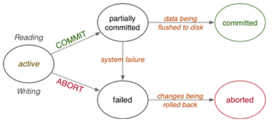
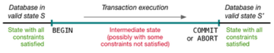
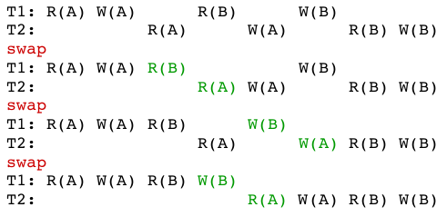
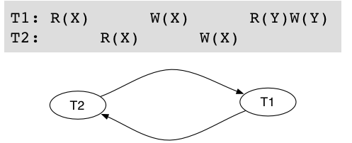
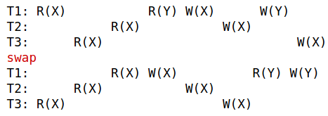
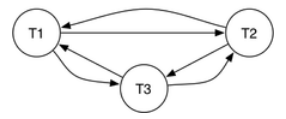

# Transactions and Concurrency

DBMSs provide valuable information resource in an environment that is:

* **shared** - concurrent access by multiple users
* **unstable** - potential for hardware/software failure

Each user should see the system as:

* **unshared** - their work in not inadvertently affected by others
* **stable** - the data survives in the face of system failures

The ultimate goal is that **_data integrity is maintained at all times_**

**Transaction processing** is a technique for managing "logical units of work" which may require multiple database operations  
**Concurrency control** techniques are for ensuring that multiple concurrent transactions do not interfere with each other  
**Recovery mechanism** techniques are used to restore information to a consistent state, even after major hardware shutdown/failures

## Transactions

A **transaction** is an atomic "unit of work" in an application which may require multiple database changes.

Transactions happen in a multi-user, unreliable environment.

To maintain integrity of data, transactions must be **ACID**;

* **Atomic** - either fully complete or totally rolled-back
* **Consistent** - map the database between consistent states
* **Isolated** - transactions do not interfere with each other
* **Durable** - persistent, restorable after system failure

An example transaction: a bank fund transfer  

* move N dollars from account X to account Y
* `Accounts(id,name,balance,heldAt,...)`
* `Branches(id,name,address,assets,...)`
* maintain `Branches.assets` as the sum of balances via triggers
* transfer implemented by function which
    * has three parameters: account, source account, destination account
    * checks validity of supplied accounts
    * checks sufficient available funds
    * returns a unique transaction ID

``` sql
create or replace function transfer(N integer, Src text, Dest text) returns integer
declare
    sID integer;
    dID integer;
    avail integer;
begin
    select id,balance into sID,avail from Accounts where name=Src;
    if (sID is null) then
        raise exception 'Invalid source account %',Src;
    end if;
    select id into dID from Accounts where name=Dest;
    if (dID is null) then
        raise exception 'Invalid dest account %',Dest;
    end if;
    if (avail < N) then
        raise exception 'Insufficient funds in %',Src;
    end if;
    -- total funds in system = NNNN
    update Accounts set balance = balance-N where id = sID;
    -- funds temporarily "lost" from system
    update Accounts set balance = balance+N where id = dID;
    -- funds restored to system; total funds = NNNN
    return nextval('tx_id_seq');
end;
```

### Transaction Concepts

A transaction must always terminate either

* **successfully** (`COMMIT`), with all changes preserved
* **unsuccessfully** (`ABORT`), with database unchanged



To describe the transaction effects, we consider

* `READ` - transfer data from disk to memory
* `WRITE` -transfer data from memory to disk
* `ABORT` - terminate transaction, unsuccessfully
* `COMMIT` - terminate transaction, successfully

Normally we abbreviate them to `R(X)`, `W(X)`, `A`, `C`

* `SELECT` produces `READ` operations on the database
* `INSERT` produces `WRITE` operations
* `UPDATE`, `DELETE` produce both `READ` and `WRITE` operations

### Transaction Consistency

Transactions typically have intermediate states that are invalid. However, states **before** and **after** a transaction must be valid.



Reminder: valid = consistent = satisfying all state constraints on the data

Transaction descriptions can be abstracted.  
Consider only `READ` and `WRITE` operations on shared data; e.g. T1: R(X) W(X) R(Y) W(Y), T2: R(X) R(Y) W(X) W(Y)

A **schedule** defines a specific execution of one or more transactions. They are typically concurrent, with interleaved operations

Arbitrary interleaving of operations cause **anomalies**, so that two consistency-preserving transactions produce a final state which is not consistent

### Schedules

**Serial** execution: `T1` then `T2` or `T2` then `T1`

``` txt
T1: R(X) W(X) R(Y) W(Y)
T2:                     R(X) W(X)
or
T1:           R(X) W(X) R(Y) W(Y)
T2: R(X) W(X)
```

Serial execution guarantees a consistent final state if

* the initial state of the database is consistent
* T1 and T2 are consistency-preserving

**Concurrent** schedules interleave `T1`, `T2`,... operations

Some concurrent schedules are ok e.g.

``` txt
T1: R(X) W(X)      R(Y)      W(Y)
T2:           R(X)      W(X)
```

Other concurrent schedules cause anomalies e.g.

``` txt
T1: R(X)      W(X)      R(Y) W(Y)
T2:      R(X)      W(X)
```

We want the system to ensure that only valid schedules occur.

Example of a concurrent schedule involving three transactions:

``` txt
T1: R(X)      W(X)      R(Y)                W(Y)
T2:      R(Y)                W(Y)      R(X)
T3:                R(X)           W(X)           W(Z)
```

Example of a _serial_ schedule involving three transactions:

``` txt
T1:                R(X) W(X) R(Y) W(Y)
T2:                                    R(Y) W(Y) R(X)
T3: R(X) W(X) W(Z)
```

Serial schedules (e..g T1 then T2 then T3) are _valid and safe_  
Not all concurrent schedules are valid (e.g. the example above ins not safe)

### Serializability

A **serializable** schedule is a concurrent schedule for T1 ..  Tn with the final state S, such that S is the also the final state of one of the possible serial schedules for T1 .. Tn. Basically a concurrent schedule that is equivalent to a serial schedule

Abstracting this needs a notion of **schedule equivalence**.

There are two common formulations of _serializabiliity_:

* **conflict serializability** (read/write operations occur in the "right" order)
* **view serializability** (read operations _see_ the correct version of data)

#### Conflict Serializability

Consider two transactions T1 and T2 acting on data item X.  
The possible order for read/write operations by T1 and T2

| T1 first    | T2 first    | Equivalent? |
| ---         | ---         | ---         |
| R1(X) R2(X) | R2(X) R1(X) | yes         |
| R1(X) W2(X) | W2(X) R1(X) | no          |
| W1(X) R2(X) | R2(X) W1(X) | no          |
| W1(X) W2(X) | W2(X) W1(X) | no          |

If T1 and T2 act on different data items, the result is **always** equivalent

Two transactions have a potential **_conflict_** if

* they perform operations on the **same data item**
* at least one of the operations is a **write operation**

In such cases, the order of operations affects the result.

If there is no conflict, we can swap the order without affecting the result

If we can transform a schedule by swapping the order of non-conflicting operations such that the result is a serial schedule then we say that the schedule is **conflict serializable**

Example: transform a concurrent schedule to a serial schedule



To show conflict serializability we show that ordering in a concurrent schedule cannot be achieved in any serial schedule  
Conflict serializability can also be tested via a **precedence graph**

1. build a **precedence graph**
2. nodes represent transactions
3. arcs represent order of action on shared data  
draw an arc for transaction 1 to transaction 2 if
    1. `R1(X)` before `W2(X)`
    2. `W1(X)` before `R2(X)`
    3. `W1(X)` before `W2(X)`  
Note that we ignore `R1(X)` before `R2(X)`
4. arc from T1 → T2 means T1 acts on X before T2
5. cycles indicate **not** conflict serializable

Example: build a precedence graph for the following schedule



Example of a schedule which is not conflict serializable:



Precedence graph for the above schedule:



#### View Serializability

**View serializability** is an alternative formulation of serializability that is **_less conservative/strict_** than conflict serializability. Some safe schedules that are view serializable are not conflict serializable. **If a schedule is conflict-serializable, it must also be view serializable.**

As with conflict serializability, it is based on the notion of schedule equivalence. A schedule is "safe" if it is **_view equivalent_** to a serial schedule

The idea is, if across the two schedules:

* they read the same version of a shared object
* they write the same final version of an object

then there are **view equivalent**

Two schedules S and S' on T1 .. Tn are _view equivalent_ iff **for each** shared data item X

* if, in S, Tj reads the initial value of X, then, in S', Tj also reads the initial value of X  
(in both schedules the **_same transaction is the first to read_** the value of X)
* if, in S, Tj reads X written by Tk , then, in S' Tj also reads the value of X written by Tk in S'  
(both schedules interact with data items in the **_same order_**)
* if, in S, Tj performs the final write of X, then, in S', Tj also performs the final write of X  
(in both schedules the **_same transaction is the last to write_** the value of X)

To check the serializability of S, find a serial schedule that is **_view equivalent_** toS from among `n!` possible serial schedules

## Concurrency Control

Serializability tests are useful theoretically, but they don't provide a mechanism for organising schedules. They can only be done after the event and are computationally every expensive; `O(n!)`

What is required are methods that can be applied to each transaction individually and guarantee that the overall schedule is serializable

Approaches to ensuring ACID transactions:

* **lock-based** - synchronise transaction execution via locks on some portion of the database
* **version-based** - allow multiple consistent versions of the data to exist, and allow each transaction exclusive access to one version
* **timestamp-based** - organise transaction execution in advance by assigning timestamps to operations
* **validation-based** (optimistic concurrency control) - exploit typical execution-sequence properties of transactions to determine safety dynamically

### Lock-based Concurrency Control

**Lock-based concurrency control** synchronises access to shared data items via the following rules:

* before reading X, get shared (read) lock on X
* before writing X, get exclusive (write) lock on X
* an attempt to get a shared lock on X is blocked if another transaction already has exclusive lock on X
* an attempt to get an exclusive lock on X is blocked if another transaction has **any** kind of lock on X

These rules alone do not guarantee serializability but **two-phase locking** does. In this you acquire all needed locks before performing any unlocks.

Locking also introduce potential for deadlock and starvation

Examples of locking:

``` txt
Schedule 1
T1: Lx(X)       R(X)           W(X) U(X)
T2:       Lx(Y)      R(Y) W(Y)           U(Y)
Schedule 2
T1: Lx(X)       R(X) W(X) U(X)
T2:       Lx(X) .............. R(X) W(X) U(X)
```

New operations: `Lx()` - exclusive lock, `Ls()` = shared lock, `U()` = unlock  
Note: in schedule 2, locking forces serial execution. This is not generally the case; there may be some concurrency.

In general, locking reduces concurrency, but gains safety.

#### Locking Performance

Locking reduces concurrency resulting in lower throughput.

The **_granularity_** of locking can impact performance:

**+** lock a small item ⇒ more of database accessible  
**+** lock a small item ⇒ quick update ⇒ quick lock release  
**-** lock small items ⇒ more locks ⇒ more lock management

Granularity levels: field, row (tuples), table, whole database  
Many DBMSs support multiple lock-granularities

### Multi-version Concurrency Control

One approach to reducing the requirement for locks is to provide multiple (consistent) versions of the database. We give each transaction access to an "appropriate" version (i.e. a version that maintains the serializability of the transaction).

This approach is called **multi-version concurreny control (MVCC)**

Difference between MVCC and standard locking models:

* writing never blocks reading (make new versions of tuple)
* reading never blocks writing (read old version of tuple)

PostgreSQL pioneered MVCC as a concurrency control mechanism.

In PostgreSQL MVCC:

* each tuple is tagged with the (time of) transaction that created/deleted it
* each tuple is linked to the next newer version of the same tuple

Access to a tuple requires checking the most recent version which existed when the transaction started; we use that version

A periodic `vaccum` process deletes tuples that are not accessible to any currently executing transaction.

Time/space overheads in implementing MVCC are justified by reduced requirement for locking (⇒ more concurrency)

### Concurrency Control in SQL

Transactions in SQL are specified by:

* `BEGIN` to start a transaction
* `COMMIT` to successfully complete a transaction
* `ROLLBACK` to undo changes made by a transaction and abort

In PostgreSQL, other actions that cause rollback:

* **raise exception** during the execution of a function
* returning `NULL` from a **before** trigger

Concurrent access can be controlled via SQL:

* table-level locking: applying lock to entire table
* row-level locking: applying lock to just some rows

`LOCK TABLE` explicitly acquires the lock on an entire table.

Other SQL commands implicitly acquire locks e.g.

* `ALTER TABLE` acquires an exclusive lock on a table
* `UPDATE`, `DELETE` acquire locks on affected rows

All locks are released at the end of transactions (with no explicit unlock)
